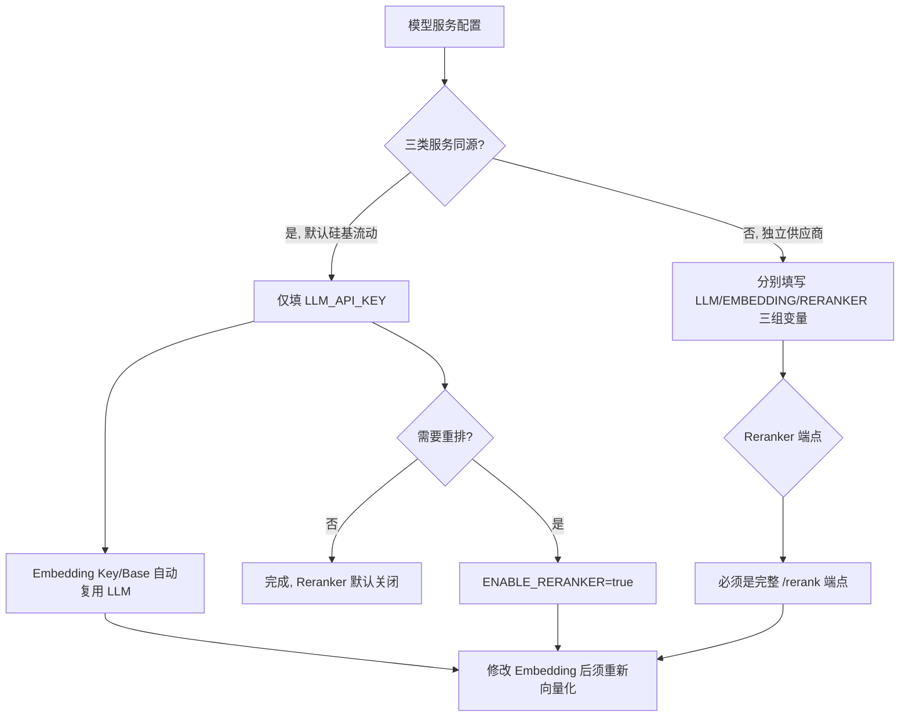
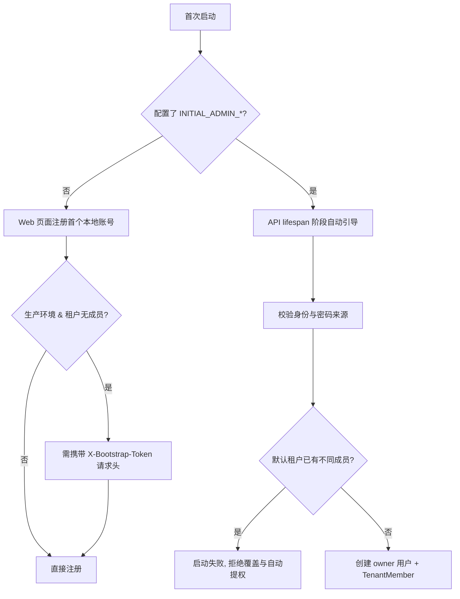
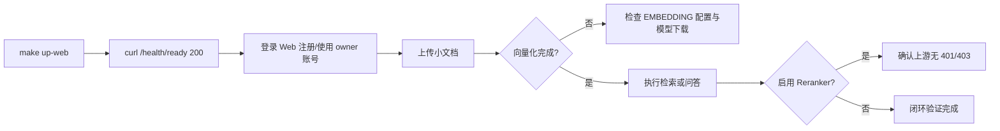

本页面向新部署场景，说明两件在启动前必须理解的事：**如何让 MimirQ 连通外部模型服务**（LLM、Embedding、Reranker 三类 OpenAI 兼容接口），以及**如何在首次启动时完成管理员引导**（交互式注册与无人值守自动引导双路径）。部署方式的选择（完整栈 / 轻量 / 源码开发）已在上一页 [部署方式选择：完整栈、轻量与源码开发](3-bu-shu-fang-shi-xuan-ze-wan-zheng-zhan-qing-liang-yu-yuan-ma-kai-fa) 中说明，本页聚焦于拿到代码后"填哪些环境变量、为何这样设计"。

## 一、生成本地配置：`make init`

仓库不内置 `.env`，需要先从模板复制并填充随机密钥。`make init` 实际上是 `scripts/init_env.py` 的包装（Makefile 中 `init:` 目标直接调用该脚本）：

```bash
git clone --depth 1 --single-branch https://github.com/skygazer42/MimirQ.git
cd MimirQ
make init          # 无 GNU Make 时执行 python scripts/init_env.py
```

`init_env.py` 的行为是非破坏性的：只创建缺失的 `.env` 与 `web/.env.local`，已存在的文件一律跳过（除非显式 `--force`）；随后以最佳努力方式在 `.env` 中填充随机生成的 `SECRET_KEY`，并为 `.env` 与 `web/.env.local` 填入同一对 `MARKDOWN_IMAGE_PROXY_SECRET`（前端图片代理与后端共享此密钥）。`--dry-run` 可预览将发生的变更而不写入。真实密钥不应提交到仓库。

Sources: [scripts/init_env.py](scripts/init_env.py#L9-L118)、[Makefile](Makefile#L177-L179)

## 二、模型服务：三类 OpenAI 兼容接口

MimirQ 本身不内置大模型，所有模型能力均通过 **OpenAI 兼容协议** 接入外部服务。系统区分三类模型角色，各自独立配置：

| 角色 | 用途 | 关键变量 | 默认值 |
|:---|:---|:---|:---|
| **LLM（对话/生成）** | 问答生成、抽取、总结 | `LLM_API_KEY` / `LLM_API_BASE` / `LLM_MODEL` | 硅基流动 `Qwen/Qwen3-32B` |
| **Embedding（向量化）** | 文档入库、检索向量化 | `EMBEDDING_PROVIDER` / `EMBEDDING_MODEL` / `EMBEDDING_API_KEY` / `EMBEDDING_API_BASE` | `BAAI/bge-m3`，Key/Base 复用 LLM |
| **Reranker（重排）** | 检索结果精排（默认关闭） | `ENABLE_RERANKER` / `RERANKER_PROVIDER` / `RERANKER_MODEL` / `RERANKER_API_KEY` / `RERANKER_API_BASE` | `BAAI/bge-reranker-v2-m3`，Key 复用 LLM |

需要强调的设计约束：**`LLM_API_KEY` 是完成真实模型调用与知识库闭环的最低要求，但不是 FastAPI 进程存活检查的必要条件**。未配置真实模型时服务可以正常启动，但聊天、向量化或入库都会在调用时失败——这是新部署最容易困惑的点，健康检查（见第五节）不会暴露这个问题。

Sources: [docs/guides/model_services.md](docs/guides/model_services.md#L5-L15)、[.env.example](.env.example#L475-L481)、[.env.example](.env.example#L548-L557)、[.env.example](.env.example#L1533-L1545)

### 默认配置：一个 Key 完成 LLM 与 Embedding

默认指向硅基流动的 OpenAI 兼容接口，因此**最小真实闭环只需填写一个值**：

```dotenv
LLM_API_KEY=<your-siliconflow-api-key>
```

这得益于三层 Key/Base 复用机制，均已在源码中验证：

- `EMBEDDING_API_BASE` 留空时复用 `LLM_API_BASE`；`EMBEDDING_API_KEY` 留空时复用 `LLM_API_KEY`（`_base_embedding_config()` 中通过 `or` 链回退）
- `RERANKER_API_KEY` 留空时同样回退到 `LLM_API_KEY`（reranker 工厂构造时二次回退）
- 如需启用默认 Reranker，只需追加 `ENABLE_RERANKER=true`；`RERANKER_API_BASE=https://api.siliconflow.cn/v1/rerank` 已经是**完整请求端点**

Sources: [app/services/dataset_embedding_config.py](app/services/dataset_embedding_config.py#L39-L40)、[app/rag/reranker/factory.py](app/rag/reranker/factory.py#L127)、[.env.example](.env.example#L1533-L1545)

### 三服务使用独立地址

当三个模型来自不同供应商或自建网关时，分别填写完整配置：

```dotenv
# Chat / generation：OpenAI-compatible Base URL
LLM_API_BASE=https://llm.example.com/v1
LLM_API_KEY=<llm-key>
LLM_MODEL=<chat-model>

# Embedding：OpenAI-compatible Base URL
EMBEDDING_PROVIDER=openai_compatible
EMBEDDING_API_BASE=https://embedding.example.com/v1
EMBEDDING_API_KEY=<embedding-key>
EMBEDDING_MODEL=<embedding-model>

# Reranker：完整 rerank 请求 URL，不是普通 /v1 Base URL
ENABLE_RERANKER=true
RERANKER_PROVIDER=openai
RERANKER_API_BASE=https://reranker.example.com/rerank
RERANKER_API_KEY=<reranker-key>
RERANKER_MODEL=<reranker-model>
```

三条注意事项：

1. `LLM_API_KEY` 必须非空；即使可信的本地兼容网关不校验鉴权，也要填写它接受的占位值。
2. 模型 ID 必须与供应商实际暴露的名称一致。
3. **修改 Embedding 模型、供应商或向量维度后，必须重新向量化已有知识库**——不能在同一向量索引中混用不同 Embedding space（索引按 embedding space 哈希分片，混用会导致检索语义错乱）。

配置项还包含工程化参数：LLM 侧有 `LLM_MODEL_FAST` / `LLM_MODEL_HEAVY`（可选动态路由）、`LLM_TEMPERATURE`、`LLM_TIMEOUT`、`LLM_MAX_RETRIES`；Embedding 侧有批量大小、最大并发、重试退避；Reranker 侧工程化参数最丰富，包括 `RERANKER_API_BATCH_SIZE`、`RERANKER_API_MAX_CONCURRENCY`、`RERANKER_API_RATE_LIMIT_QPS`、指数退避重试、熔断器（连续失败阈值 + 冷却时间）与进程内缓存（TTL/最大条目数）。这些参数在 `Settings` 类中均有默认值，启动时经 `config_validation.py` 逐项校验。

Sources: [docs/guides/model_services.md](docs/guides/model_services.md#L36-L52)、[app/core/config.py](app/core/config.py#L371-L375)、[app/core/config.py](app/core/config.py#L477-L492)、[app/core/config.py](app/core/config.py#L1943-L1985)、[.env.example](.env.example#L1551-L1648)

### 主机与 Docker 的网络地址差异

模型服务的位置决定了 `.env` 中应填写的地址，这是部署中最常见的坑：

| 模型服务位置 | 主机源码启动 | Docker 一键启动 |
|:---|:---|:---|
| 公网 / 局域网服务 | `https://models.example.com/v1` | 相同地址 |
| 当前主机上的服务 | `http://127.0.0.1:<port>/v1` | Docker Desktop 用 `http://host.docker.internal:<port>/v1` |
| 另一台内网机器 | `http://<lan-ip>:<port>/v1` | 相同地址，但须允许容器所在主机访问 |

Linux Docker 默认不保证解析 `host.docker.internal`：此时应使用主机可达的局域网 IP，或在私有 Compose override 中添加 `host.docker.internal:host-gateway`。注意 `DOCKER_BUILD_NETWORK=host` 只影响镜像构建阶段，**不会改变容器运行时访问模型服务的网络方式**。

Sources: [docs/guides/model_services.md](docs/guides/model_services.md#L54-L68)



## 三、首次管理员配置：双路径设计

MimirQ 提供两条互斥的首次管理员路径，选择取决于部署是否有人值守：

| 路径 | 触发条件 | 适用场景 | 特征 |
|:---|:---|:---|:---|
| **交互式注册** | 不配置 `INITIAL_ADMIN_*` | 本地开发、有运维人员 | 启动后访问 Web 页面注册第一个本地账号 |
| **无人值守引导** | 配置 `INITIAL_ADMIN_*` 四变量 | 生产自动化部署 | API 启动阶段自动创建 owner 并写入租户 |

Sources: [docs/guides/model_services.md](docs/guides/model_services.md#L70-L87)



### 路径一：交互式注册与注册令牌

未配置 `INITIAL_ADMIN_*` 时，注册接口 `POST /api/v1/auth/register` 承担"引导第一个租户 owner"的职责：`UserService.create_user` 会为新用户创建默认租户并赋予 `owner` 角色，随后签发访问令牌。请求体为 `email`（EmailStr）、`username`（3-64 字符）、`password`（8-72 字节，bcrypt 上限 72 字节）。

生产环境存在一道安全闸门：**当 `is_production_env()` 为真且默认租户尚无成员时，注册必须携带 `X-Bootstrap-Token` 请求头**，否则返回 403。令牌来源是 `INITIAL_REGISTRATION_TOKEN` 环境变量，支持两种形式：

- **原始令牌**：直接比较（`hmac.compare_digest` 恒定时间比较防时序攻击）
- **sha256 摘要**：`sha256:<64位hex>`，明文只保存在部署侧，适合 CI 或密钥管理系统

`INITIAL_REGISTRATION_TOKEN` 的 sha256 格式在配置启动校验时强制检查 64 位 hex。一旦租户已有成员（`_initial_registration_open` 返回 false），令牌要求自动失效——即该机制只保护"首次开放注册"这一个窗口。

Sources: [app/api/v1/auth.py](app/api/v1/auth.py#L44-L106)、[app/api/schemas/auth.py](app/api/schemas/auth.py#L21-L25)、[app/core/config_validation.py](app/core/config_validation.py#L150-L155)、[.env.example](.env.example#L245-L249)

### 路径二：无人值守自动引导（INITIAL_ADMIN_*）

生产无人值守部署配置四个变量，其中密码来源二选一：

```dotenv
INITIAL_ADMIN_EMAIL=owner@example.com
INITIAL_ADMIN_USERNAME=owner
INITIAL_ADMIN_PASSWORD=<strong-password>
# 生产建议改用密码文件 / Docker secret：
# INITIAL_ADMIN_PASSWORD_FILE=/run/secrets/mimirq_initial_admin_password
```

引导逻辑在 `app/services/initial_admin_service.py` 中实现，由 `app/main.py` 的 lifespan 启动流程调用（数据库表创建完成后、任务队列初始化前）：

```python
if bootstrap_initial_admin_if_configured(db):
    logger.info("Bootstrapped initial local administrator from environment")
```

若引导失败则抛 `InitialAdminBootstrapError` 并升级为 `RuntimeError` **阻止进程启动**——这是 fail-closed 设计，宁可启动失败也不留下身份不明的管理员。

Sources: [app/main.py](app/main.py#L263-L269)、[app/services/initial_admin_service.py](app/services/initial_admin_service.py#L170-L190)

引导流程分四步校验，每步都有明确的失败语义：

1. **身份完整性**：`INITIAL_ADMIN_EMAIL` 与 `INITIAL_ADMIN_USERNAME` 必须同时非空；邮箱经 `email_validator` 规范化并转小写，用户名要求 3-64 字符。
2. **密码来源互斥**：`INITIAL_ADMIN_PASSWORD` 与 `INITIAL_ADMIN_PASSWORD_FILE` 必须恰好配置一个——两者都填或都不填都会报错。密码文件有硬性约束：≤4096 字节、必须 UTF-8 编码、允许末尾换行（读取时剥离 `\r\n`）；密码长度须 ≥ `PASSWORD_MIN_LENGTH`（默认 8）且 ≤ 72 字节（bcrypt 上限）。
3. **默认租户归属**：`DEFAULT_TENANT_ID` 必须是合法 UUID，owner 创建在该租户下（租户不存在时自动创建 `status=active, plan=basic` 的默认租户）。
4. **冲突保护**：若默认租户已有任何成员但**不是**配置的匹配 owner，直接抛错拒绝覆盖与自动提权；若邮箱或用户名与任何既有用户冲突（含交叉匹配：邮箱撞用户名、用户名撞邮箱），同样抛错——系统**永远不会在检测到既有租户状态后自动开放匿名 owner 注册**。

Sources: [app/services/initial_admin_service.py](app/services/initial_admin_service.py#L61-L121)、[.env.example](.env.example#L253-L257)、[app/core/config.py](app/core/config.py#L842-L845)、[app/core/config.py](app/core/config.py#L2415)

### 幂等性与并发安全

引导是**幂等**的，这是多实例部署正确性的基础：

- **重复启动不重置密码**：`_matching_owner` 找到"邮箱 + 用户名 + 活跃状态 + owner 角色"全部匹配的既有用户时直接返回 False，不触碰密码哈希（测试 `test_initial_admin_bootstrap_is_idempotent_and_keeps_existing_password_hash` 验证了这一点）。
- **并发竞态**：多 API 副本同时首启时，`_bootstrap_once` 先以 `with_for_update` 行锁锁定租户行；即使仍发生 `IntegrityError`，也会回滚后重查——若获胜副本已创建出配置的活跃 owner，则视为合法的幂等结果，否则抛错。
- **密码永不回显**：配置校验错误信息只包含规则描述，绝不包含密码本身（`test_initial_admin_validation_never_echoes_password` 专门守护这一点）。

**多实例部署的操作纪律**：所有副本首次启动必须使用完全相同的 `INITIAL_ADMIN_*` 值；创建成功后应从所有实例统一删除这些变量，避免凭据残留。

Sources: [app/services/initial_admin_service.py](app/services/initial_admin_service.py#L89-L110)、[app/services/initial_admin_service.py](app/services/initial_admin_service.py#L123-L168)、[tests/test_initial_admin_bootstrap.py](tests/test_initial_admin_bootstrap.py#L119-L152)、[tests/test_initial_admin_bootstrap.py](tests/test_initial_admin_bootstrap.py#L77-L88)

### 故障排查：首次设置已关闭但不知道管理员账号

先检查 `.env` 中是否配置过 `INITIAL_ADMIN_EMAIL`、`INITIAL_ADMIN_USERNAME` 及密码来源——若配置过，启动阶段已创建 owner，直接使用该账号登录即可。Docker 命名卷不会随重新构建或重新克隆仓库自动删除，旧数据库中的成员会持续存在。

只有在**确认这是无业务数据的本地新安装**时，才可删除 Compose 数据卷并重新初始化：

```bash
make docker-reset
make up-web
```

⚠️ `down -v`（`docker-reset` 内部行为）会**永久删除** PostgreSQL、Milvus、MinIO、Etcd 和上传文件等本地持久化数据；需要保留数据时绝不要执行，而应使用已有账号登录或由部署管理员进行受控账号恢复。

Sources: [docs/guides/model_services.md](docs/guides/model_services.md#L87-L100)、[Makefile](Makefile#L284-L286)

## 四、启动与验证

### 启动命令对照

| 部署方式 | 命令 | 说明 |
|:---|:---|:---|
| Docker 一键启动 | `make up-web` → `make ps` | 默认启用任务队列并自动启动 Worker |
| 主机应用 + Docker 基础设施 | `make setup-host` → `make backend` → `make web` | 默认 `TASK_QUEUE_ENABLED=false`，API 进程内处理后台任务 |
| 启用独立队列 | `.env` 设 `TASK_QUEUE_ENABLED=true` → 重启 API → 第三个终端 `make worker` | 可用 `make worker-check` 检查存活标记 |

Sources: [Makefile](Makefile#L187-L191)、[Makefile](Makefile#L318-L327)、[docs/guides/model_services.md](docs/guides/model_services.md#L102-L113)

### 就绪探针 ≠ 模型连通

```bash
curl --noproxy '*' -f http://localhost:8000/api/v1/health/ready
```

`GET /api/v1/health/ready` 返回 200 仅表示数据库、向量库、Redis、MinIO 等运行依赖可达（任一下线则 503）；它**不探测任何外部模型**。完整状态可查看 `GET /api/v1/health/details`（需管理员身份，额外返回向量后端、任务队列与上传目录状态）。

因此首次部署的**真实闭环验证**必须是端到端的：登录 Web → 上传一份小文档 → 等待向量化完成 → 执行一次带引用的检索或问答；启用 Reranker 时同时检查上游没有 401/403 等鉴权错误。`/api/v1/health`（无 `/ready` 后缀）仅是进程存活探针，恒定返回 `{"ok": true}`。

Sources: [app/api/v1/health.py](app/api/v1/health.py#L253-L298)、[docs/guides/model_services.md](docs/guides/model_services.md#L114-L123)



## 五、阅读路线建议

本页解决了"启动前要填什么"的问题。接下来按依赖顺序建议：

- 想理解配置在系统中的加载与校验全貌，进入 [总体架构与技术栈](5-zong-ti-jia-gou-yu-ji-zhu-zhan)；身份认证与令牌体系详见 [API 分层设计与认证鉴权](6-api-fen-ceng-she-ji-yu-ren-zheng-jian-quan)。
- 管理员引导写入的 `Tenant` / `TenantMember` / `User` 表结构，在 [数据模型与数据库迁移](7-shu-ju-mo-xing-yu-shu-ju-ku-qian-yi) 与 [多租户、RBAC 与文档级 ACL](8-duo-zu-hu-rbac-yu-wen-dang-ji-acl) 中有完整说明。
- 向量化产物最终写入的存储体系（Milvus/MinIO/PostgreSQL），见 [存储层：向量库、对象存储与关系库](24-cun-chu-ceng-xiang-liang-ku-dui-xiang-cun-chu-yu-guan-xi-ku)。
- 生产环境下的密钥管理、JWT 加固与限流策略，见 [安全加固：JWT、PII 与限流](27-an-quan-jia-gu-jwt-pii-yu-xian-liu)。