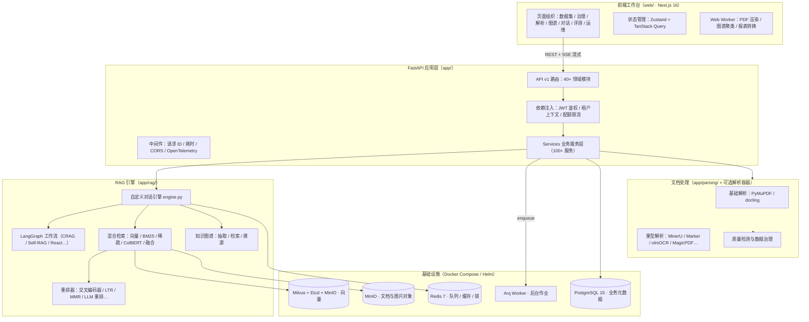
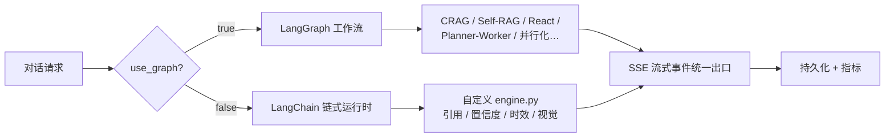
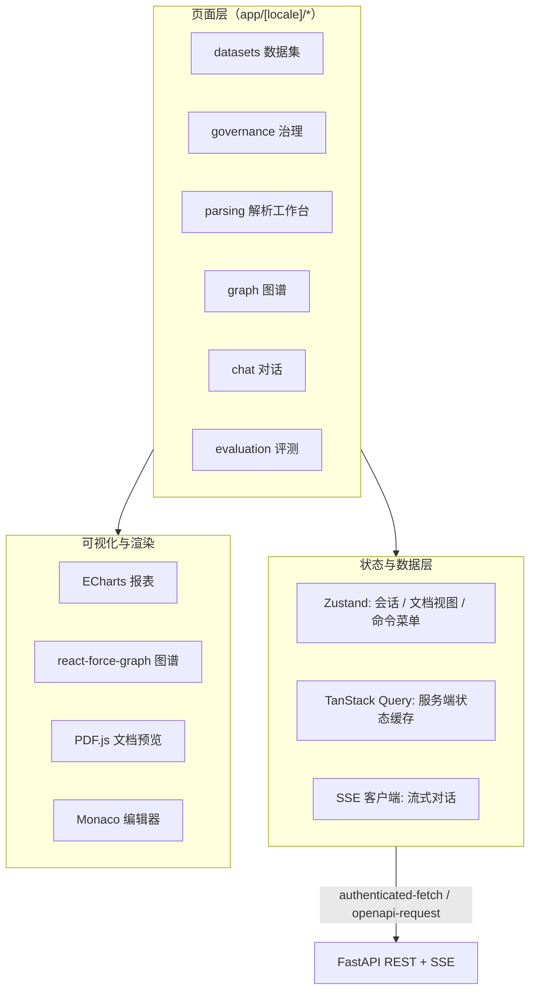

本页从全局视角回答三个问题：**MimirQ 由哪些子系统组成、各层之间如何协作、为什么做出这些技术选型**。内容聚焦系统蓝图与技术栈全景，API 分层、数据模型、检索算法等细节将在后续页面逐一展开。需要说明的是，仓库中的 [docs/architecture.md](docs/architecture.md#L1-L60) 记录了早期设计（Next.js 14 + 纯 LangChain 链路），而当前代码已演进为 Next.js 16 + 自定义 RAG 引擎 + LangGraph 双执行路径，本文以代码实际状态为准。

## 一、系统全景：从文档到可信答案的完整链路

MimirQ 的架构围绕企业知识的生命周期组织，README 将业务闭环概括为八个阶段：**资料接入 → 智能解析 → 清洗治理 → 业务切块 → 混合检索 → 重排生成 → 引用追溯 → 质量回归**（[README.md](README.md#L52-L60)）。这八个阶段并非线性流水线，而是"入库链路"与"问答链路"两条主线的组合：入库链路负责把多源资料转化为高质量知识单元，问答链路负责在正确的数据范围内检索证据并生成带引用的答案。

上图是系统的静态分层；数据视角上，**入库**与**问答**两条链路共享解析、存储与评测设施，这是 MimirQ"一体化知识平台"定位的架构基础。仓库规模也印证了这一点：后端约 28 个 SQLAlchemy 模型（[app/models](app/models)）、100+ 业务服务（[app/services](app/services)）、40+ API 路由模块（[app/api/v1](app/api/v1)）。

## 二、后端：FastAPI 单体应用与领域分层

后端是一个**模块化单体（Modular Monolith）**：单一 FastAPI 进程承载全部 HTTP 能力，内部按领域边界清晰分层，通过进程内函数调用而非远程调用协作，从而在保持部署简单的同时维持高内聚。

| 层 | 目录 | 职责 |
|:---|:---|:---|
| 接入层 | `app/api/` | 路由、Pydantic Schema、依赖注入（鉴权/租户）、中间件 |
| 领域服务层 | `app/services/` | 业务编排：对话运行时、入库策略、评测门禁等 |
| 引擎层 | `app/rag/`、`app/parsing/` | RAG 编排、混合检索、重排、解析后端 |
| 数据层 | `app/models/`、`app/storage/` | ORM 模型、向量存储与对象存储抽象 |
| 基础设施 | `app/core/`、`app/tasks/` | 配置中心、数据库单例、任务队列、可观测性 |

应用入口 [app/main.py](app/main.py#L1-L120) 完成 FastAPI 实例装配：注册 CORS 中间件、请求 ID 与耗时中间件、异常处理器、OpenTelemetry 与 Sentry，并在启动生命周期内初始化数据库引擎、Redis 队列与可选的管理员引导。路由聚合集中在 [app/api/v1/__init__.py](app/api/v1/__init__.py#L30-L80)，通过 `include_router` 挂载 40+ 领域模块，覆盖文档、数据集、对话、解析、图谱、证据、评测、治理、连接器、SCIM、RBAC 等——这种"一文件一领域"的组织方式让 API 边界与测试边界天然对齐。

技术选型上，后端基于 **FastAPI 0.135 + Python 3.11**（[requirements.txt](requirements.txt#L15-L16)），ORM 使用 **SQLAlchemy 2.0 + asyncpg**，迁移由 **Alembic** 管理——仓库已有 26 个版本迁移（[alembic/versions](alembic/versions)），数据库会话与引擎通过单例模块共享（[app/core/database.py](app/core/database.py#L1-L23)）。配置体系采用 pydantic-settings，[app/core/config.py](app/core/config.py#L1-L60) 承载 2500+ 行配置定义，涵盖安全、模型、RAG 参数、存储后端与解析策略，并配有专门的配置校验模块。

## 三、RAG 引擎：自定义编排 + 双执行路径

MimirQ 的 RAG 引擎是该平台最核心的架构决策：**没有直接交给框架，而是在 LangChain 生态之上构建了自定义编排层**。[app/rag/engine.py](app/rag/engine.py#L1-L80) 是一个 4000+ 行的对话引擎，它复用 LangChain 的原语（`ChatOpenAI`、`ChatPromptTemplate`、`StrOutputParser`），但注入了大量自研能力：引用构建与句子级引用渲染、忠实度与置信度评分、上下文悬崖检测、时间意图识别与时效性加权、查询改写策略、视觉阅读器（多模态输入）、知识图谱检索等。这意味着"回答质量可解释、可评测"被放在了引擎的一等位置。

对话流式输出存在**两条执行路径**，由请求级 `use_graph` 标志选择（[app/api/schemas/chat.py](app/api/schemas/chat.py#L374)）：

两条路径由 [app/services/chat_stream_orchestrator.py](app/services/chat_stream_orchestrator.py#L297-L378) 统一编排：先做模型提供方可用性预检与熔断判断，再按标志分派到图运行时或链式运行时，最终以统一的 SSE 事件流输出。LangGraph 工作流目录（[app/rag/workflows](app/rag/workflows)）提供了 CRAG（纠正式检索）、Self-RAG、React、Planner-Worker、并行化、查询改写、系统路由等 16 种可组合模式，供高级对话场景选用。

检索与重排同样是"可插拔"设计。混合检索目录（[app/rag/retrieval/hybrid](app/rag/retrieval/hybrid)）包含 BM25 索引、稀疏索引、ColBERT 索引、词法检索、去重、融合排序与后处理；重排器目录（[app/rag/reranker](app/rag/reranker)）提供 15 类实现：交叉编码器、ColBERT、LTR（基于 XGBoost 的排序学习）、MMR、LLM 重排、混合重排、父子文档重排、长上下文重排、知识图谱重排等。这些能力的组合细节属于后续页面（混合检索、重排器体系）的范畴，此处只需建立心智模型：**检索链路是一条由配置驱动的流水线，每一段都可替换、可评测**。

## 四、文档处理：多解析后端与隔离执行

文档解析被设计为**后端可插拔**：用户可根据资料类型（扫描件、表格、公式、网页）选择解析器，而不是把所有内容交给同一种处理方式。解析后端规范化集中在 [app/parsing/backends.py](app/parsing/backends.py#L1-L72)，内部维护了 20+ 别名映射，覆盖三类形态：

| 类别 | 解析后端 | 说明 |
|:---|:---|:---|
| 内置基础 | `basic`（PyMuPDF）、`docling`、`pandoc` | 轻量、随主进程运行 |
| 本地重型 | `deepdoc`、`magicpdf`、`paddlevl`、`colpali` | 依赖 torch/视觉模型，容器隔离 |
| 外部服务 | `mineru`、`marker`、`olmocr`、`qianfan_ocr`、`textin`、`etl4llm` | 独立 FastAPI 容器或 SaaS 调用 |

重型解析器通过 `docker/docker-compose.parsers.yml` 按需拉起独立容器（[docker/docker-compose.parsers.yml](docker/docker-compose.parsers.yml#L15-L20)），主进程通过 [app/parsing/subprocess_runner.py](app/parsing/subprocess_runner.py) 以子进程隔离方式执行，避免解析器的崩溃或内存问题波及 API 主进程。解析产物（Markdown、版面信息、图片）随后进入质量检测与数据治理环节，这部分在数据治理页面详述。

## 五、存储与基础设施

存储层遵循"**每种数据形态选择最合适的引擎**"原则，由 Docker Compose 统一编排（[docker/docker-compose.yml](docker/docker-compose.yml#L57-L240)）：

| 存储 | 版本 | 承载内容 | 访问方式 |
|:---|:---|:---|:---|
| PostgreSQL | 15 | 租户、用户、数据集、文档、对话、评测等业务元数据 | SQLAlchemy + asyncpg |
| Milvus | 2.6 standalone | 文档向量、图谱向量 | pymilvus + Etcd(元数据) + MinIO(向量文件) |
| Redis | 7 | arq 任务队列、缓存、分布式锁、幂等去重 | `REDIS_URL` DSN |
| MinIO | S3 兼容 | 原始文档、解析图片、预览资源 | minio SDK |

向量存储是可替换的：`VECTOR_BACKEND` 环境变量（默认 `milvus`，见 [.env.example](.env.example#L701)）决定底层实现，[app/storage/vector/factory.py](app/storage/vector/factory.py#L1-L80) 已实现 **Milvus、PGVector、Qdrant、Chroma、FAISS** 五条路径，其中 FAISS/Chroma 作为可选依赖按需加载，Milvus 通过单例封装（[app/storage/vector/__init__.py](app/storage/vector/__init__.py#L1-L20)）。对象存储同样抽象了 MinIO / S3 / 阿里云 OSS / 腾讯云 COS 的别名映射（[app/core/config.py](app/core/config.py#L28-L46)）。

后台作业由 **arq + Redis** 承载：API 侧负责入队（[app/tasks/queue.py](app/tasks/queue.py#L1-L80)），独立 worker 进程消费（[app/tasks/worker.py](app/tasks/worker.py#L24-L33)），核心作业包括文档处理、连接器同步、知识图谱抽取、索引重建、数据集预检/画像扫描等（[app/tasks/jobs.py](app/tasks/jobs.py#L409-L1523)）。API 与 worker 共享同一镜像，仅在启动命令上区分，简化了部署模型。

## 六、前端：Next.js 16 企业工作台

前端是独立于后端的 Next.js 应用（`web/`），采用 **Next.js 16.2.11 + React 19 + TypeScript 5.9** 的 App Router 架构（[web/package.json](web/package.json#L73-L77)）。国际化通过 `next-intl` 与 `[locale]` 路由段实现，默认中文优先（[web/app](web/app)）。页面组织覆盖知识运营全场景：数据集、文档库、数据治理、解析工作台、知识图谱、对话、评测、可观测性、运维与审计等 30+ 顶级路由。

前端技术栈的选择服务于"操作清晰、证据可查"的设计目标：**Zustand 5** 管理客户端会话与视图状态（[web/package.json](web/package.json#L94)），**TanStack Query** 负责服务端数据缓存与失效（[web/package.json](web/package.json#L57)），**Radix UI + Tailwind CSS 4 + shadcn/ui** 提供无障碍基础组件，**ECharts** 承载评测报表、**react-force-graph** 渲染知识图谱、**PDF.js** 提供文档预览、**Monaco Editor** 支持解析工作台编辑（[web/package.json](web/package.json#L67-L76)）。仓库现有 288 个组件、24 个 hooks，并通过 Web Worker 将图谱聚类、PDF 渲染等重计算移出主线程（[web/workers](web/workers)）。前端架构的详细组织在后续页面展开。

## 七、配置驱动与部署形态

整个平台遵循**配置驱动**原则：行为差异（向量后端、稀疏检索提供方、解析后端、重排器、模型提供方）都通过环境变量表达，而不是修改代码。[.env.example](.env.example#L475-L701) 展示了配置维度：LLM 提供方（OpenAI 兼容接口，默认 SiliconFlow + Qwen3-32B）、Embedding 提供方（默认 `BAAI/bge-m3`）、`VECTOR_BACKEND`、稀疏检索提供方与各类重排器开关。

部署上提供三种渐进形态，均由 Makefile 封装常用命令（[Makefile](Makefile#L1-L60)）：

| 形态 | 编排文件 | 适用场景 |
|:---|:---|:---|
| 完整栈 | `docker-compose.yml` + `docker-compose.web.yml` + `docker-compose.parsers.yml` | 生产/演示，含重型解析器 |
| 轻量 | `docker-compose.lite.yml` | 快速体验，仅 Redis + PostgreSQL |
| 源码开发 | `make up-dev` / `make up-dev-web` | 本地开发热重载 |

Kubernetes 部署另有 Helm Chart（[deploy/helm/mimirq](deploy/helm/mimirq)）。部署方式的取舍详见部署章节，此处不展开。

## 八、技术栈总览

| 层 | 技术选型 | 版本要点 |
|:---|:---|:---|
| 前端框架 | Next.js (App Router) + React + TypeScript | 16.2.11 / 19.2.5 / 5.9 |
| UI 体系 | Tailwind CSS + Radix UI + shadcn/ui 风格 | Tailwind 4 |
| 前端状态 | Zustand + TanStack Query + SSE 客户端 | Zustand 5 |
| 数据可视化 | ECharts / react-force-graph / PDF.js / Monaco | — |
| 后端框架 | FastAPI + Uvicorn | 0.135 / 0.44 |
| ORM 与迁移 | SQLAlchemy 2.0 + Alembic + asyncpg | 26 个迁移、28 个模型 |
| AI 编排 | LangChain 1.x + LangGraph 1.2 + 自定义引擎 | 双执行路径 |
| 关系库 | PostgreSQL | 15 |
| 向量库 | Milvus（默认）/ PGVector / Qdrant / Chroma / FAISS | 2.6 |
| 对象存储 | MinIO / S3 / OSS / COS | minio SDK |
| 任务队列 | arq + Redis | Redis 7 |
| 解析生态 | PyMuPDF / docling / MinerU / Marker / olmOCR / MagicPDF / DeepDoc / PaddleOCR-VL… | 30+ 后端 |
| 检索算法 | BM25 / 稀疏向量 / ColBERT / RRF 融合 | rank-bm25 / jieba / hanlp |
| 重排器 | 交叉编码器 / ColBERT / LTR / MMR / LLM / 混合 | 15 类 |
| 认证与安全 | PyJWT / signxml / SAML / SCIM / RBAC | — |
| 可观测性 | OpenTelemetry / Prometheus / Sentry / Phoenix | — |

来源：后端依赖见 [requirements.txt](requirements.txt#L15-L90)，前端依赖见 [web/package.json](web/package.json#L57-L94)，基础设施编排见 [docker/docker-compose.yml](docker/docker-compose.yml#L57-L240)。

## 九、关键架构决策

**1. 自定义 RAG 引擎而非纯框架。** 平台复用 LangChain/LangGraph 原语，但将引用、置信度、忠实度、时效、KG 检索等质量能力内建到引擎层，这是"回答可验证、质量可回归"产品主张的架构前提（[app/rag/engine.py](app/rag/engine.py#L1-L80)）。

**2. 一切关键环节可插拔。** 解析后端、向量存储、稀疏检索、重排器、Embedding 提供方均为策略化接口，通过配置切换，使平台能在不同基础设施预算下运行，同时支撑评测体系对单一变量的对照实验。

**3. 单体内聚、进程外解耦。** API 与 worker 共享代码库与镜像、按进程拆分；重型解析器按需独立容器化，隔离故障域与资源占用（[docker/docker-compose.parsers.yml](docker/docker-compose.parsers.yml#L15-L20)）。

**4. 配置即契约。** 2500+ 行 pydantic-settings 配置与专门的校验模块，让部署形态差异收敛为环境变量差异，降低私有化交付成本（[app/core/config.py](app/core/config.py#L1-L60)）。

## 十、阅读路径建议

本页建立了整体心智模型，建议按以下路径深入：

- 想看请求如何被鉴权、分层与流转：**「[API 分层设计与认证鉴权](6-api-fen-ceng-she-ji-yu-ren-zheng-jian-quan)」**
- 想理解 28 个模型与 26 个迁移如何组织：**「[数据模型与数据库迁移](7-shu-ju-mo-xing-yu-shu-ju-ku-qian-yi)」**
- 想深入双执行路径与流式输出：**「[RAG 对话引擎与流式输出](16-rag-dui-hua-yin-qing-yu-liu-shi-shu-chu)」**
- 想了解检索与重排的算法细节：**「[混合检索与多路融合排序](14-hun-he-jian-suo-yu-duo-lu-rong-he-pai-xu)」「[重排器体系与 LTR 排序学习](15-zhong-pai-qi-ti-xi-yu-ltr-pai-xu-xue-xi)」**
- 想看前端工作台的实现：**「[前端架构与核心页面组织](21-qian-duan-jia-gou-yu-he-xin-ye-mian-zu-zhi)」**
- 想了解存储与部署落地：**「[存储层](24-cun-chu-ceng-xiang-liang-ku-dui-xiang-cun-chu-yu-guan-xi-ku)」「[部署运维](28-bu-shu-yun-wei-docker-compose-yu-helm)」**