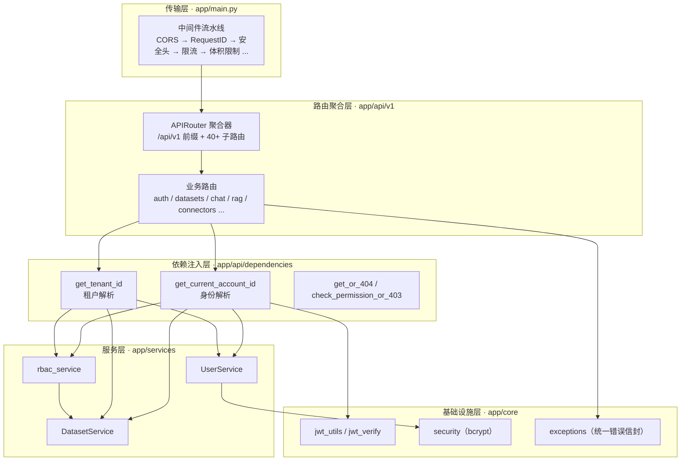
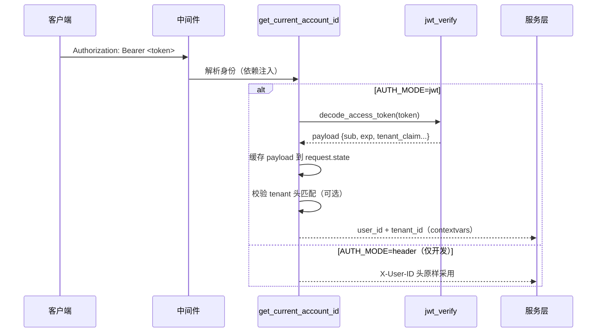
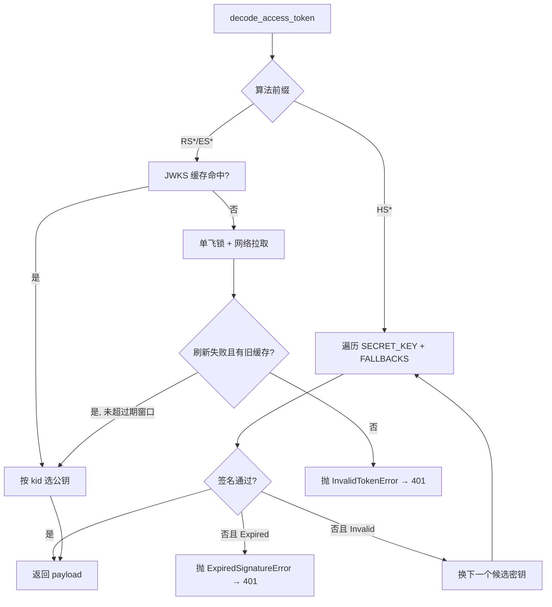
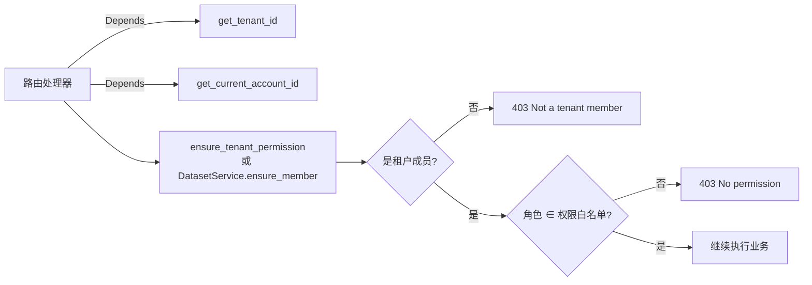

本文深入剖析 MimirQ 后端的 API 分层架构与认证鉴权体系：从中间件流水线到路由聚合、依赖注入、服务层与基础设施层，再到 JWT 签发验证、租户解析、RBAC 授权与统一错误信封。理解这一层结构，是阅读后续[数据模型与数据库迁移](7-shu-ju-mo-xing-yu-shu-ju-ku-qian-yi)、[多租户、RBAC 与文档级 ACL](8-duo-zu-hu-rbac-yu-wen-dang-ji-acl)等页面的前提。

## 一、分层全景：一次请求的五层旅程

MimirQ 基于 FastAPI 构建，API 代码按"传输 → 路由 → 依赖 → 服务 → 基础设施"五个层次组织，每一层只解决一类问题。这种分层的直接收益是：路由文件保持薄（只做参数绑定与响应组装）、业务逻辑集中在 `services/`、可复用的横切能力（认证、限流、日志、错误封装）下沉到 `dependencies/` 与 `core/`。



路由文件通过 FastAPI 的 `Depends` 声明依赖，依赖注入在每次请求时由框架解析执行，返回的身份与租户信息被写入 `request.state` 与 contextvars，供服务层通过[请求级上下文](app/core/request_state.py#L1-L35)间接读取，避免把 `Request` 对象层层穿透到业务代码。Sources: [request_state.py](app/core/request_state.py#L1-L35)、[main.py](app/main.py#L578-L578)

## 二、传输层：中间件流水线

`app/main.py` 在应用启动时按固定顺序注册了十个中间件。需要特别说明的是：Starlette 中**最后注册的中间件位于最外层**，因此实际请求自外向内依次穿过 CORS → RequestID → ResponseHeaderSanitizer → SecurityHeaders → ProcessTime → Prometheus → GZip → RateLimit → BodySizeLimit → TrustedHost，最后才进入业务路由。代码注释明确要求 CORS 必须最后注册，使其包裹限流与安全错误响应——否则浏览器会把 429/403 响应当作不透明 CORS 失败，无法读取错误体。Sources: [main.py](app/main.py#L459-L581)

| 中间件 | 职责 | 触发条件 | 关键配置 |
|---|---|---|---|
| CORSMiddleware | 跨域白名单 + 暴露响应头 | 始终启用 | `CORS_ORIGINS`、`CORS_EXPOSE_HEADERS`；开发环境自动扩展 localhost 别名端口 |
| RequestIDMiddleware | 生成/透传 `X-Request-ID`，绑定日志上下文 | 始终启用 | 头部名称可配置；非法值（换行、超长）会被重置为随机 UUID |
| ResponseHeaderSanitizer | 去除指纹化响应头 | 始终启用 | 默认剥离服务器标识类头 |
| SecurityHeadersMiddleware | `X-Content-Type-Options`、`X-Frame-Options`、HSTS 等 | `SECURITY_HEADERS_ENABLED` | 默认 `nosniff` + `DENY` + 严格 referrer 策略 |
| ProcessTimeMiddleware | 响应 `X-Process-Time` 调试头 | 始终启用 | `SERVER_TIMING_ENABLED` |
| PrometheusMiddleware | HTTP 指标采集 | `PROMETHEUS_ENABLED` | 排除 `/metrics`、`/health` 等高频路径 |
| GZipMiddleware | 响应压缩 | `GZIP_ENABLED` 默认开 | SSE 事件流被 Starlette 自动排除 |
| RateLimitMiddleware | 令牌桶限流（内存或 Redis） | `RATE_LIMIT_ENABLED` | 对 `/api/v1/chat/stream` 使用独立更严格的桶 |
| BodySizeLimitMiddleware | 请求体体积上限（DoS 防护） | 始终启用 | `REQUEST_MAX_BODY_BYTES` |
| TrustedHostMiddleware | Host 头校验 | 生产环境默认开 | `ALLOWED_HOSTS` |

RequestIDMiddleware 是横切可观测性的关键：它把请求 ID 写入 `request.state`、绑定到结构化日志的 contextvars，并在响应头回写同一个 ID，使前端、日志、异常信封三者可关联。其安全处理值得一提——对传入的 `X-Request-ID` 做正则白名单校验（`^[A-Za-z0-9][A-Za-z0-9_\-:.]{0,127}$`），从源头阻断头部注入。Sources: [request_id.py](app/api/middleware/request_id.py#L42-L64)、[security_headers.py](app/api/middleware/security_headers.py#L35-L60)

## 三、路由聚合层：`/api/v1` 与模块化 APIRouter

所有业务路由统一挂在 `/api/v1` 前缀之下。`app/main.py` 仅执行一次聚合注册，并在此处为整个路由树绑定 `bind_route_context` 依赖，用于把**路由模板**（如 `/api/v1/documents/{document_id}`，而非含 UUID 的原始路径）写入日志上下文，避免高基数日志污染指标。Sources: [main.py](app/main.py#L578-L578)、[logging.py](app/api/dependencies/logging.py#L1-L44)

路由聚合器本身在 `app/api/v1/__init__.py` 中实现：通过 `_build_router()` 惰性导入约 40 个子模块（`auth`、`datasets`、`chat`、`rag`、`connectors`、`kg`、`scim` 等），每个子模块是带独立前缀与 OpenAPI 标签的 `APIRouter`。这种"聚合器 + 薄路由"模式有三个优点：一是**标签即导航**，OpenAPI 文档按领域自动分组；二是**前缀即契约**，如 `/datasets`、`/retrieval`、`/scim/v2` 各自明确；三是**延迟导入**降低冷启动开销——`__getattr__` 钩子让 `app.api.v1.<submodule>` 的访问按需加载，测试与脚本无需触发整棵依赖树。Sources: [v1/__init__.py](app/api/v1/__init__.py#L18-L114)

每个路由模块内部遵循一致的代码模式：模块级 `_DEFAULT_HTTP_EXCEPTION_RESPONSES` 声明常见错误码的 OpenAPI 描述，处理器签名以 `Annotated` 类型标注依次注入 `get_current_account_id`、`get_tenant_id`、`get_db` 三个依赖，然后调用服务层完成业务。以 `datasets.py` 为例，其 3000 余行中绝大部分是参数校验、分页与响应组装，核心业务判断（如 `ensure_member` 角色校验）全部委托给 `DatasetService`。Sources: [datasets.py](app/api/v1/datasets.py#L1-L120)、[rbac.py](app/api/v1/rbac.py#L1-L60)

## 四、依赖注入层：身份与租户的解析顺序

### 4.1 身份解析：`get_current_account_id`

`app/api/dependencies/auth.py` 定义了 API 的身份入口。它先按 `AUTH_MODE` 分流：

- **`jwt` 模式（默认）**：要求 `Authorization: Bearer <token>`，校验通过后取 `sub` 声明作为 `user_id`；若配置了 `JWT_TENANT_CLAIM`，则从 token 中解析租户 ID 并与 `X-Tenant-ID` 头做一致性校验（`JWT_ENFORCE_TENANT_HEADER_MATCH`）。
- **`header` 模式**：直接信任 `X-User-ID` 头——代码注释明确标注"unsafe; forbidden in production"，仅用于本地开发。

依赖包装器刻意保持 `async` 而非走线程池，目的是让请求作用域的 contextvars（`user_id`、`tenant_id`）在同步端点中也能正确传播。验证通过的 JWT payload 会被缓存到 `request.state._jwt_payload`，同一请求内多次依赖调用不重复解密。Sources: [auth.py](app/api/dependencies/auth.py#L172-L237)



在 JWT 模式下，还有两个企业级可选钩子：`JWT_GROUPS_SYNC_ENABLED` 将已验证 token 中的组声明同步到租户组；`JWT_TENANT_MEMBER_AUTO_PROVISION_ENABLED` 为尚未建档的 JWT 用户自动创建租户成员。两者都以"best-effort + 异步线程"执行，任何失败都不会阻断认证主流程——这是身份解析层最重要的容错原则。Sources: [auth.py](app/api/dependencies/auth.py#L119-L170)、[config.py](app/core/config.py#L884-L895)

### 4.2 租户解析：`get_tenant_id`

租户身份解析遵循严格的优先级链：**request.state（已由认证写入）→ JWT 租户声明（已验证来源）→ `X-Tenant-ID` 头 → 开发环境默认租户**。`_preferred_jwt_tenant_id` 只信任经过 `decode_access_token` 验证的 token 声明，避免伪造头；当路由使用自己的 Bearer token（如 Dify 通道）时，`get_tenant_id_from_header` 提供不解读该 token 的旁路。生产环境下缺失租户头直接返回 400，开发环境才回退到 `DEFAULT_TENANT_ID`。Sources: [tenant.py](app/api/dependencies/tenant.py#L63-L108)

这条优先级链的设计意图清晰：**已验证的身份优先于客户端自报头**。`JWT_ENFORCE_TENANT_HEADER_MATCH` 进一步把两者绑定——当开启时，token 租户声明与 `X-Tenant-ID` 必须一致，否则按 401 处理，从机制上封堵跨租户头伪造。Sources: [auth.py](app/api/dependencies/auth.py#L95-L106)、[config.py](app/core/config.py#L875-L883)

## 五、认证机制：从签发到验证

### 5.1 Token 签发

`app/core/jwt_utils.py` 的 `create_access_token` 是唯一的 token 签发入口（本地登录与 SAML 通道共用）。载荷固定包含 `sub`（用户 ID）、`exp`（默认 30 分钟，`ACCESS_TOKEN_EXPIRE_MINUTES`）、`iat`，并按配置附加 `iss`、`aud` 与租户声明。默认算法为 HS256，使用 `SECRET_KEY` 签名。Sources: [jwt_utils.py](app/core/jwt_utils.py#L35-L62)

### 5.2 Token 验证：HS* 与 JWKS 双轨

`decode_access_token` 按算法族分流，是认证的核心枢纽：

- **HS\* 系列**（本地签发）：依次尝试 `SECRET_KEY` 与 `SECRET_KEY_FALLBACKS`（逗号分隔的旧密钥轮换列表，上限 6 个）。`ExpiredSignatureError` 一旦抛出立即终止——它意味着签名已通过、无需再试其他密钥；只有 `InvalidTokenError`（签名不匹配）才继续尝试下一个候选密钥。Sources: [jwt_verify.py](app/core/jwt_verify.py#L49-L66、L332-L372)
- **RS\*/ES\* 系列**（外部 IdP）：通过 `JWT_JWKS_URLS` 拉取 JWKS 公钥。为控制性能与可用性，实现了三层保护：**TTL 缓存**（默认 300 秒）避免每请求网络往返；**单飞锁**（per-URL `asyncio.Lock`）防止并发刷新风暴；**有限过期窗口**（`JWT_JWKS_MAX_STALE_SEC` 默认 3600 秒）——刷新失败时仍可用旧密钥继续验证，超过窗口才 fail-closed。`kid` 匹配失败时还会强制刷新一次以应对密钥轮换。Sources: [jwt_verify.py](app/core/jwt_verify.py#L250-L282、L300-L330)



远程密钥拉取还有一层**防降级与防 SSRF** 设计：`validate_jwt_remote_url` 强制 https（非生产环境仅放行 localhost/loopback），并校验响应 URL 链——任何重定向跳回非 https 或不可信主机都会被拒绝，防止攻击者把 JWKS 请求引向内部地址。Sources: [jwt_verify.py](app/core/jwt_verify.py#L32-L48、L218-L248)、[config.py](app/core/config.py#L84-L113)

### 5.3 本地账号与初始引导

本地账号使用 bcrypt 哈希（`security.py`），密码长度限制为 72 字节（bcrypt 上限）。`UserService.authenticate` 以邮箱或用户名查唯一用户，校验密码哈希与活跃状态。首个租户成员的注册受 `INITIAL_REGISTRATION_TOKEN` 保护：生产环境下当默认租户尚无成员时，必须携带 `X-Bootstrap-Token` 头（支持明文或 `sha256:<hex>` 摘要形式，使用 `hmac.compare_digest` 恒定时间比较）。首次注册的用户自动成为默认租户的 `owner`，之后注册通道即关闭——这是"先到者得"的引导模型。Sources: [security.py](app/core/security.py#L7-L25)、[user_service.py](app/services/user_service.py#L37-L53、L96-L131)、[auth.py](app/api/v1/auth.py#L51-L89)

### 5.4 特殊认证通道

除标准 JWT 外，系统还有四条认证通道，各自服务于不同的信任边界：

| 通道 | 凭证 | 信任边界 | 代表端点 |
|---|---|---|---|
| SAML SSO | IdP 签发的 SAMLResponse | 后端校验断言签名 + 重放防护 | `POST /auth/saml/exchange`、`/auth/saml/bridge/consume` |
| SCIM v2 供给 | `SCIM_BEARER_TOKEN`（Bearer，支持 sha256 摘要与轮换集） | 可选 IP 白名单 + 绑定租户校验 | `/scim/v2/*` |
| Dify 外部知识 | `DIFY_EXTERNAL_KNOWLEDGE_API_KEYS`（Bearer） | 固定租户 + 固定系统账号 | `POST /integrations/dify/*` |
| 初始注册引导 | `X-Bootstrap-Token` | 仅生产 + 租户成员数为零时 | `POST /auth/register` |

SCIM 通道值得关注：它不走 `get_current_account_id`，而是独立的 `get_scim_tenant_id`——要求 `X-Tenant-ID` 必须等于配置的 `SCIM_TENANT_ID`，且 token 采用与初始注册相同的 sha256 摘要比对方式，便于安全地以哈希形式存放凭证。Dify 通道则把外部调用者映射为固定的"系统账号"（`system:dify`），使后续文档级 ACL 依然适用。Sources: [scim.py](app/api/v1/scim.py#L1-L80)、[integrations_dify.py](app/api/v1/integrations_dify.py#L1913-L1960)

## 六、授权机制：租户成员资格 + RBAC

认证解决"你是谁"，授权解决"你能做什么"。MimirQ 的授权模型是**租户作用域 RBAC**：角色挂在 `tenant_members.role` 字段上，权限以常量形式集中在 `rbac_service.py`，路由通过 `ensure_tenant_permission` 统一执行检查。

### 6.1 角色与权限映射

系统定义了六个角色（`constants.py` 的 `UserRoles`），权限映射表如下：

| 权限常量 | 允许角色 | 用途示例 |
|---|---|---|
| `settings.read` / `settings.write` | owner, admin | 租户设置读写 |
| `observability.read` | owner, admin | 可观测性看板 |
| `usage.read` | owner, admin | 用量统计 |
| `audit.read` | owner, admin, auditor | 审计日志查看 |
| `audit.manage` | owner, admin | 审计日志管理 |
| `table_sql.read` | owner, admin, auditor | 表格 SQL 读取 |
| `lifecycle.manage` | owner, admin | 文档生命周期管理 |
| `feedback_triage.write` | owner, admin, editor, dataset_operator | 反馈分诊 |

Sources: [rbac_service.py](app/services/rbac_service.py#L14-L51)、[constants.py](app/core/constants.py#L221-L239)

### 6.2 权限检查的执行链



`ensure_tenant_permission` 先调用 `DatasetService.ensure_member` 确认成员资格，再做角色白名单比对。`ensure_member` 本身内含一个开发友好行为：非生产环境下遇到不存在的租户成员会自动创建并赋予 `owner` 角色（自举式引导），而生产环境一律 403——这正是本地快速体验与生产安全隔离的分界点。Sources: [rbac_service.py](app/services/rbac_service.py#L67-L83)、[dataset_service.py](app/services/dataset_service.py#L25-L65)

`/rbac/me` 端点把这一模型暴露给前端：返回当前用户的租户 ID、角色、可用的权限列表与导航可见性，前端据此动态渲染菜单与操作按钮。同时 RBAC 管理端点对"最后一个管理员"做了防呆保护——`_lock_active_admin_members` 以 `SELECT ... FOR UPDATE` 锁定活跃管理员行，降级或移除最后一名管理员会返回 409。Sources: [rbac.py](app/api/v1/rbac.py#L66-L126)

## 七、统一错误信封

所有 API 错误（无论来自 HTTPException、参数校验还是未捕获异常）都收敛为统一的 `ErrorResponse` 结构，这是前端错误处理与[前端架构](21-qian-duan-jia-gou-yu-he-xin-ye-mian-zu-zhi)页所述 `api-errors.ts` 契约的基础：

```json
{
  "error": "AUTHENTICATION_ERROR",
  "message": "Invalid token",
  "detail": {},
  "request_id": "abc123...",
  "hint": "可选的操作建议"
}
```

HTTP 状态码到错误码的映射集中在 `http_exception_handler`：400→`BAD_REQUEST`、401→`AUTHENTICATION_ERROR`、403→`AUTHORIZATION_ERROR`、404→`NOT_FOUND`、409→`CONFLICT`、413→`PAYLOAD_TOO_LARGE`、429→`RATE_LIMIT_EXCEEDED`、422→`VALIDATION_ERROR`、500+→`INTERNAL_ERROR`。500 以上错误的原始 message 会被替换为通用文案，防止内部信息泄露。`hint` 字段由 `_derive_hint` 根据错误码与文案启发式生成，为常见失败（解析超时、文件过大、限流）提供可操作建议。Sources: [exceptions.py](app/core/exceptions.py#L63-L75、L245-L310、L345-L350)

## 八、限流与安全加固

限流中间件实现令牌桶算法，支持内存与 Redis（Lua 脚本原子操作）双后端，Redis 版在不可用时 fail-open（避免把 Redis 故障放大为全站宕机）。限流键的构造体现了"已验证身份优先"原则：`tenant:user`（有 user_id 时）→ `tenant:ip` → `ip`；在 JWT 模式下绝不信任 `X-User-ID` 头构造限流键，防止伪造头绕过限流。`/api/v1/chat/stream` 使用独立更严格的桶（`RATE_LIMIT_CHAT_RPS`），而 `/health`、`/docs` 与文档图片前缀路径被排除，避免浏览器并发渲染图片时误触限流。Sources: [rate_limit.py](app/api/middleware/rate_limit.py#L30-L56、L301-L443)

在应用层面之外，传输层还叠加了多层加固：`SECURITY_HEADERS_ENABLED` 默认开启 nosniff/DENY 帧选项/严格 referrer；HSTS 仅在生产显式开启；`ResponseHeaderSanitizer` 剥离指纹化头；`BodySizeLimitMiddleware` 在读取请求体时即拒绝超限请求（413），不进入业务代码。这些中间件与[安全加固：JWT、PII 与限流](27-an-quan-jia-gu-jwt-pii-yu-xian-liu)页面的主题直接衔接。

## 九、总结

MimirQ 的 API 层是"薄路由 + 厚服务 + 基础设施下沉"的经典 FastAPI 架构：十层中间件流水线负责横切关注点，依赖注入层以明确的优先级链解析身份与租户，认证支持 HS*/JWKS 双轨验证并内置密钥轮换与防 SSRF 保护，授权统一收敛到租户作用域的 RBAC 常量表，错误则以带 `request_id` 的统一信封返回。理解这套分层后，建议继续阅读[数据模型与数据库迁移](7-shu-ju-mo-xing-yu-shu-ju-ku-qian-yi)了解分层之下的数据底座，或直接进入[多租户、RBAC 与文档级 ACL](8-duo-zu-hu-rbac-yu-wen-dang-ji-acl)深入文档级权限的细化设计。