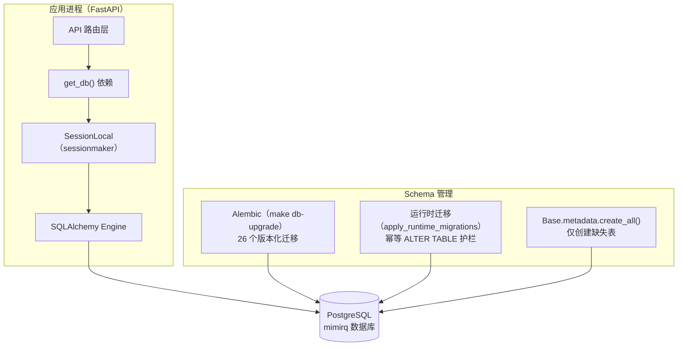
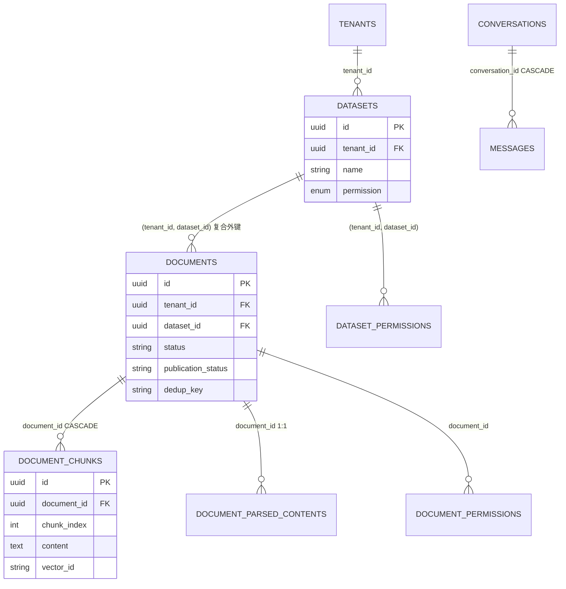
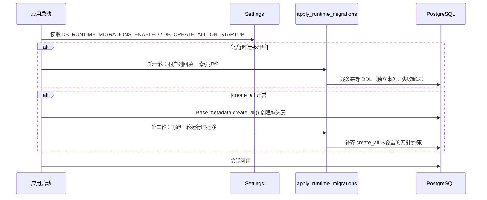

MimirQ 的关系型数据层以 **PostgreSQL + SQLAlchemy ORM** 为基石，采用"双轨迁移"策略：**Alembic 版本化迁移**作为生产环境的确定性升级路径，**运行时最佳努力迁移**作为兼容历史单租户部署的兜底护栏。本文从模型组织、核心设计模式、迁移体系演进三个维度，解析这套数据层的架构决策与工程实践。

## 数据层架构总览

MimirQ 的数据层遵循一条清晰的依赖链：FastAPI 请求通过 `get_db()` 依赖注入获取 SQLAlchemy Session，Session 由全局唯一的 `SessionLocal` 工厂创建；引擎、会话工厂与声明式基类 `Base` 全部收敛在 `app/core/database_singleton.py` 中，由 `app/core/database.py` 重新导出——这一拆分的动机是防止单元测试在 `sys.modules.pop("app.core.database")` 后重新导入时意外创建新的 `Base` 与引擎，破坏模型注册与契约测试对 `Base.metadata` 表完整性的断言 [database.py](app/core/database.py#L1-L22)、[database_singleton.py](app/core/database_singleton.py#L1-L50)。

引擎连接池参数随数据库方言自适应：非 SQLite 场景启用 `pool_size=10`、`max_overflow=20`、`pool_timeout=30s`、`pool_recycle=1800s`，并默认开启 `pool_pre_ping` 以探测失效连接；SQLite 仅保留 `pool_pre_ping`。这些参数均可在 `Settings` 中通过环境变量覆盖 [database_singleton.py](app/core/database_singleton.py#L27-L44)、[config.py](app/core/config.py#L165-L171)。

Sources: [database.py](app/core/database.py#L1-L22), [database_singleton.py](app/core/database_singleton.py#L27-L63), [config.py](app/core/config.py#L165-L171)

## ORM 模型组织与加载机制

模型文件按领域垂直切分在 `app/models/` 下，知识图谱实体则独立存放于 `app/rag/kg/models.py`。`app/models/__init__.py` 只导出常用模型作为便捷入口，而 `app/models/_all.py` 负责**副作用导入**：将所有模型模块逐一导入，使每个 `__tablename__` 注册进 `Base.metadata`——这是 Alembic autogenerate 能生成完整 schema 的前提。该模块被明确标注为"仅供工具链与测试代码导入，请求路径上禁止引用"，以避免启动期的急切加载副作用 [_all.py](app/models/_all.py#L1-L39)。

| 领域 | 模型文件 | 核心表 |
|---|---|---|
| 租户与用户 | `tenant.py` / `user.py` / `tenant_group.py` | `tenants`、`tenant_members`、`users`、`tenant_groups`、`tenant_group_members` |
| 知识库 | `dataset.py` / `dataset_category.py` | `datasets`、`dataset_permissions`、`dataset_categories`、`dataset_category_memberships` |
| 文档流水线 | `document.py` / `chunk.py` / `chunk_preset.py` / `ingestion_run.py` / `ingest_dead_letter.py` | `documents`、`document_chunks`、`document_parsed_contents`、`document_permissions`、`chunk_presets`、`ingestion_runs`、`ingestion_run_documents`、`ingest_dead_letters` |
| 对话与反馈 | `chat.py` / `conversation_summary.py` / `feedback.py` | `conversations`、`messages`、`conversation_summaries`、`message_feedback` |
| 连接器 | `connector.py` / `connector_config.py` / `db_catalog.py` | `connector_runs`、`connector_run_documents`、`connector_configs`、`db_catalog_tables`、`db_catalog_columns`、`db_profile_snapshots` |
| 评测与证据 | `evaluation.py` / `evidence.py` | `ragas_evaluation_runs/items`、`ragas_regression_cases/runs/items`、`kg_search_diagnostics_runs`、`evidence_suites`、`evidence_items` |
| 治理与运营 | `governance_profile.py` / `audit_log.py` / `index_drift_item.py` / `rag_config_template.py` / `prompt_template.py` / `group_permissions.py` | `governance_profiles`、`audit_logs`、`index_drift_items`、`rag_config_templates`、`prompt_templates`、`dataset_group_permissions`、`document_group_permissions` |
| 知识图谱 | `app/rag/kg/models.py` | `kg_entities`、`kg_source_events`、`kg_event_entities`、`kg_relations`、`kg_entity_aliases`、`kg_entity_resolution_actions`、`kg_entity_redirects`、`kg_predicate_ontology` |

基线迁移一次性创建 39 张表 [0001_baseline_schema.py](alembic/versions/0001_baseline_schema.py#L19-L20)，后续迁移新增 13 张（`kg_relations`、`kg_search_diagnostics_runs`、`tenant_groups`、`tenant_group_members`、`dataset_group_permissions`、`document_group_permissions`、`rag_config_templates`、`ingest_dead_letters`、`kg_entity_aliases`、`kg_entity_resolution_actions`、`kg_entity_redirects`、`kg_predicate_ontology`、`index_drift_items`），当前全库约 52 张表。

Sources: [__init__.py](app/models/__init__.py#L4-L19), [_all.py](app/models/_all.py#L12-L39)

## 核心设计模式

### 租户作用域复合外键

这是多租户数据层的**最关键约束**。由于 `documents.dataset_id` 仅引用同租户下的数据集，普通单列外键不足以表达"数据集必须属于同一租户"的语义。解决方案是在 `datasets` 上建立 `UNIQUE (tenant_id, id)` 复合唯一约束，再让子表通过 `FOREIGN KEY (tenant_id, dataset_id) REFERENCES datasets (tenant_id, id)` 引用它 [dataset.py](app/models/dataset.py#L26-L31)、[document.py](app/models/document.py#L33-L48)。`connector_runs`、`connector_configs`、`db_catalog_tables`、`ingestion_runs`、扫描运行表等均沿用同一模式，从而在数据库层面杜绝跨租户数据关联 [0001_baseline_schema.py](alembic/versions/0001_baseline_schema.py#L327-L352)。

### JSONB 灵活元数据

几乎所有核心表都保留一个 `metadata`/`payload`/`config`/`stats`/`extra_data` 类型的 JSONB 列，用于承载随产品迭代而增长的半结构化信息：`datasets.metadata` 存放流水线与治理默认值 [dataset.py](app/models/dataset.py#L40-L41)，`documents.metadata` 存放文件哈希、流水线哈希等解析产物指纹 [document.py](app/models/document.py#L98-L99)，`messages.citations` 存放检索引用结构 [chat.py](app/models/chat.py#L60-L66)。这一模式让新字段上线不必立即改表，但也意味着查询依赖表达式索引（见下文检索加速节）。

### 部分唯一索引与软删除

`documents.dedup_key` 是软删除与唯一性结合的典范：`uq_documents_tenant_dataset_dedup_key_active` 是带 `WHERE archived_at IS NULL AND dataset_id IS NOT NULL AND dedup_key IS NOT NULL` 条件的部分唯一索引，既保证"活跃文档在同一数据集内文件指纹唯一"，又允许历史归档文档保留重复指纹 [document.py](app/models/document.py#L40-L47)。文档与块均保留 `archived_at`/`disabled_at` 软删除列，配合 `processing_attempts`、`next_retry_at`、`failed_stage`、`error_code` 形成完整的失败重试生命周期 [document.py](app/models/document.py#L83-L106)。

Sources: [dataset.py](app/models/dataset.py#L17-L72), [document.py](app/models/document.py#L30-L116), [chat.py](app/models/chat.py#L16-L71)

## Alembic 规范迁移体系

### 环境配置

`alembic/env.py` 采用三层 URL 解析优先级：应用 `Settings.DATABASE_URL`（支持 .env）→ 环境变量 `DATABASE_URL` → `alembic.ini` 兜底值；同时通过导入 `app.models._all` 加载完整元数据，并在在线/离线模式均开启 `compare_type` 与 `compare_server_default`，确保 autogenerate 能捕捉列类型与服务端默认值差异 [env.py](alembic/env.py#L37-L112)。`alembic.ini` 中的 `sqlalchemy.url` 仅作最小化工具环境的回退 [alembic.ini](alembic.ini#L9-L12)。

### 26 个版本的演进脉络

| 版本 | 主题 | 类型 |
|---|---|---|
| 0001 | 基线 schema（39 表 + 枚举类型） | 初始 |
| 0002–0005 | `kg_relations`、KG 搜索诊断、`pipeline_hash` | 功能扩展 |
| 0006 | 实体消歧四表（别名/动作日志/重定向/谓词本体） | 功能扩展 |
| 0007–0009 | `chunk_presets.dataset_id`、文档生命周期字段、发布状态 | 功能扩展 |
| 0010–0012 | 租户组、组权限、SCIM 供应加固 | 企业功能 |
| 0013–0014 | RAG 配置模板、会话标题来源 | 功能扩展 |
| 0015–0016 | 死信表 + 文档失败字段；KG 事件 `pipeline_hash` 数据修复 | 治理/修复 |
| 0017–0018 | Dify 元数据锚点与别名 GIN 索引 | 索引加速 |
| 0019–0022 | 反馈分诊字段、租户成员唯一化、会话属主回填、最新消息索引 | 加固/修复 |
| 0023–0025 | 文档去重键、入库运行唯一化、扫描运行唯一化 | 数据一致性 |
| 0026 | `index_drift_items` 索引漂移追踪 | 功能扩展 |

0022 之前的历史版本号存在超长 revision id，因此 0002 在创建 `kg_relations` 之前先执行 `ALTER TABLE alembic_version ALTER COLUMN version_num TYPE VARCHAR(255)`，将版本号列从默认的 VARCHAR(32) 加宽，避免后续迁移写入失败 [0002_add_kg_relations.py](alembic/versions/0002_add_kg_relations.py#L17-L20)。

Sources: [0002_add_kg_relations.py](alembic/versions/0002_add_kg_relations.py#L11-L49), [0006_add_kg_entity_resolution_and_ontology.py](alembic/versions/0006_add_kg_entity_resolution_and_ontology.py#L23-L95), [0010_add_tenant_groups.py](alembic/versions/0010_add_tenant_groups.py#L17-L48), [0015_ingest_dead_letters.py](alembic/versions/0015_ingest_dead_letters.py#L12-L45)

## 运行时最佳努力迁移：双轨的另一侧

与 Alembic 并行的，是 `app/core/migrations.py` 中的 `apply_runtime_migrations(engine)`。它是一组**幂等 DDL 语句**（`ALTER TABLE ... IF NOT EXISTS`、`CREATE INDEX IF NOT EXISTS`），只作用于 PostgreSQL，逐条在独立事务中执行并吞掉失败——注释明确说明"PostgreSQL 中一旦语句在事务内报错，整个事务即失效，因此每条 DDL 必须独立事务，一次失败不能阻塞其余语句" [migrations.py](app/core/migrations.py#L472-L487)。

启动流程在 `main.py` 中体现为"先迁移、再建表、再迁移"的三段式 [main.py](app/main.py#L244-L262)。两个开关默认开启（`DB_CREATE_ALL_ON_STARTUP=true`、`DB_RUNTIME_MIGRATIONS_ENABLED=true`），生产环境建议关闭并改用 Alembic 外部执行 [config.py](app/core/config.py#L173-L185)、[.env.example](.env.example#L19-L25)。

运行时迁移覆盖三大类场景：**历史单租户表回填**（为 `documents`、`conversations`、`messages` 等 14 张表补 `tenant_id` 并默认到 `DEFAULT_TENANT_ID`）[migrations.py](app/core/migrations.py#L37-L57)、**检索热路径索引**（`pg_trgm` 扩展、`document_chunks` 的 GIN 全文/模糊索引、Dify 元数据锚点表达式索引）[migrations.py](app/core/migrations.py#L216-L259)、以及**镜像 Alembic 迁移的守卫**（死信表、文档去重键、复合外键等）[migrations.py](app/core/migrations.py#L143-L177)。

Sources: [migrations.py](app/core/migrations.py#L60-L66), [migrations.py](app/core/migrations.py#L472-L490), [main.py](app/main.py#L244-L262)

## 数据修复型迁移模式

迁移链中多次出现"**先清洗、后加约束**"的修复模式，其通用套路是：用窗口函数 `row_number() OVER (PARTITION BY ...)` 对重复数据排序打标，删除 `position > 1` 的多余行，再创建唯一约束。

- **0020 租户成员唯一化**：按 `(tenant_id, user_id)` 分区，排序优先级为 `is_active` → `is_current` → 角色（owner > admin > 其他）→ 创建时间，删除重复成员后建立 `uq_tenant_members_tenant_user` 唯一约束 [0020_unique_tenant_membership.py](alembic/versions/0020_unique_tenant_membership.py#L11-L35)。
- **0023 文档去重键回填**：从 `metadata->>'file_sha256'` 与 `metadata->>'pipeline_hash'` 拼接出 `dedup_key`，仅对活跃文档、`rn=1` 的行回填，再创建部分唯一索引；`failed` 状态行被降权，确保失败重试不被唯一约束阻塞 [0023_add_document_dedup_key.py](alembic/versions/0023_add_document_dedup_key.py#L11-L39)。
- **0024 入库运行唯一化**：删除 `(tenant_id, run_id, document_id)` 重复附件后，还通过 `RETURNING` + CTE 链**重算**受影响 `ingestion_runs` 的 `stats`（`total_documents`、`status_counts`、`progress`），将状态归一化（completed/failed/quarantined/cancelled/processing/pending）后重新聚合。其 docstring 明确警示"重复行清理不可逆，降级仅移除约束、无法恢复已删数据" [0024_ingestion_run_document_uniqueness.py](alembic/versions/0024_ingestion_run_document_uniqueness.py#L1-L128)。

迁移的正确性由集成测试守护：`test_alembic_upgrade_from_prior_revision.py` 在临时 PostgreSQL 库中先升级到中间版本、按旧 schema 形状插入"历史数据"、再升级到 `head`，断言回填结果与索引存在性 [test_alembic_upgrade_from_prior_revision.py](tests/test_alembic_upgrade_from_prior_revision.py#L55-L96)；`test_core_schema_integration.py` 则验证 tenant → dataset → document → chunk → conversation → message 的核心知识流在迁移后 schema 上可完整落库 [test_core_schema_integration.py](tests/test_core_schema_integration.py#L9-L74)。

Sources: [0020_unique_tenant_membership.py](alembic/versions/0020_unique_tenant_membership.py#L11-L35), [0023_add_document_dedup_key.py](alembic/versions/0023_add_document_dedup_key.py#L11-L39), [0024_ingestion_run_document_uniqueness.py](alembic/versions/0024_ingestion_run_document_uniqueness.py#L15-L128), [test_alembic_upgrade_from_prior_revision.py](tests/test_alembic_upgrade_from_prior_revision.py#L99-L178)

## 运维实践与版本管理

日常迁移操作收敛在 Makefile 两个目标中：`make db-upgrade` 执行 `python scripts/alembic_cli.py -c alembic.ini upgrade head`，`make db-revision` 执行 `revision --autogenerate -m "$(m)"` [Makefile](Makefile#L567-L571)。CLI 包装脚本的存在是为了兼容 Windows/CI 中 `alembic` 控制台脚本不在 PATH 的场景 [alembic_cli.py](scripts/alembic_cli.py#L1-L20)。

| 操作 | 命令 | 适用场景 |
|---|---|---|
| 升级到最新 | `make db-upgrade` | 生产/预发部署，确定性迁移 |
| 自动生成新迁移 | `make db-revision m="描述"` | 修改模型后生成候选迁移，需人工审查 |
| 启动自愈（默认开启） | `MIMIRQ_DB_CREATE_ALL_ON_STARTUP=true` + `MIMIRQ_DB_RUNTIME_MIGRATIONS_ENABLED=true` | 本地开发、轻量部署 |
| 外部接管 schema | 两个开关置 `false` | 生产环境，Alembic 带外执行 |

基线迁移的 docstring 明确指出：Alembic 引入前已存在的数据库，应在校验 schema 兼容性后使用 `alembic stamp head` 标记版本，而非重放建表语句 [0001_baseline_schema.py](alembic/versions/0001_baseline_schema.py#L1-L7)。历史 SQL 脚本 `docs/migrations/20241210_multitenant.sql` 与 `20241211_dataset_permissions.sql` 是双轨迁移的前身，其中的"加列 → 回填默认租户 → 置 NOT NULL"序列正是运行时迁移中 `_tenant_id_migrations` 的原型 [20241210_multitenant.sql](docs/migrations/20241210_multitenant.sql#L1-L40)、[20241211_dataset_permissions.sql](docs/migrations/20241211_dataset_permissions.sql#L1-L30)。

Sources: [Makefile](Makefile#L567-L571), [alembic_cli.py](scripts/alembic_cli.py#L13-L20), [0001_baseline_schema.py](alembic/versions/0001_baseline_schema.py#L1-L7)

## 设计权衡小结

双轨迁移并非冗余，而是服务两种截然不同的生命周期诉求：Alembic 链提供**可审计、可回滚、可测试**的确定性升级，适合生产发布；运行时迁移提供**零停机、幂等、失败不阻塞**的启动自愈，适合本地开发与存量单租户数据库的渐进式多租户化。代价是两处 DDL 来源需保持语义同步——`migrations.py` 中大量注释标明"Mirrors Alembic 0015/0017/0018"正是这一同步义务的体现 [migrations.py](app/core/migrations.py#L143-L148)。团队约定生产环境以 Alembic 为准、运行时迁移仅作守卫，避免了双轨漂移的失控。

## 下一步阅读

本文聚焦关系型数据层；多租户隔离的运行时语义（RLS、ACL 判定）见 [多租户、RBAC 与文档级 ACL](8-duo-zu-hu-rbac-yu-wen-dang-ji-acl)，向量库与对象存储构成的三存储架构见 [存储层：向量库、对象存储与关系库](24-cun-chu-ceng-xiang-liang-ku-dui-xiang-cun-chu-yu-guan-xi-ku)，数据库运维与备份恢复策略见 [部署运维：Docker Compose 与 Helm](28-bu-shu-yun-wei-docker-compose-yu-helm)。