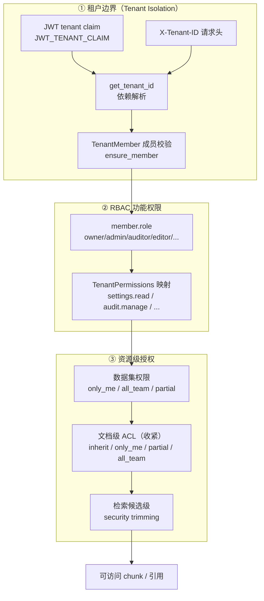
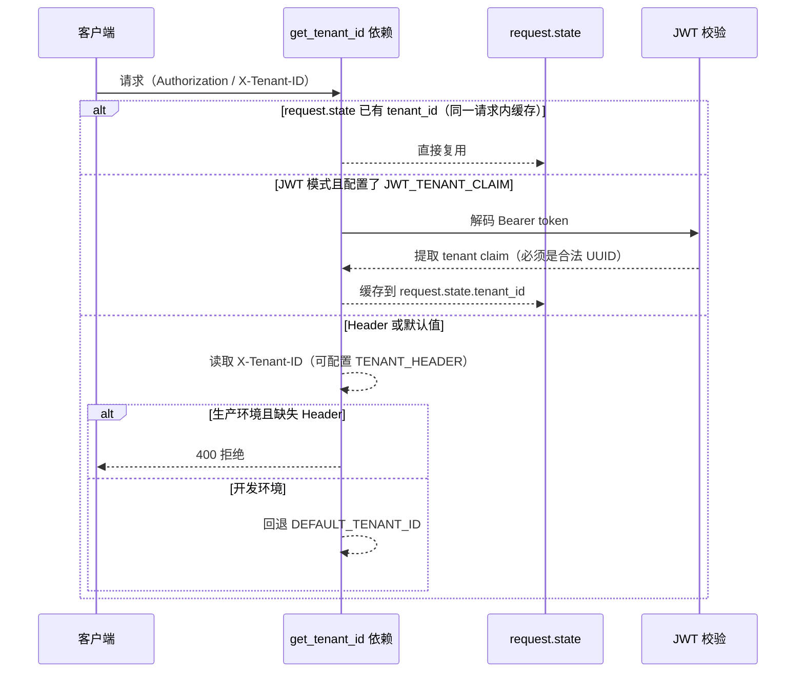
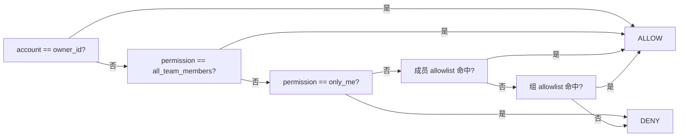
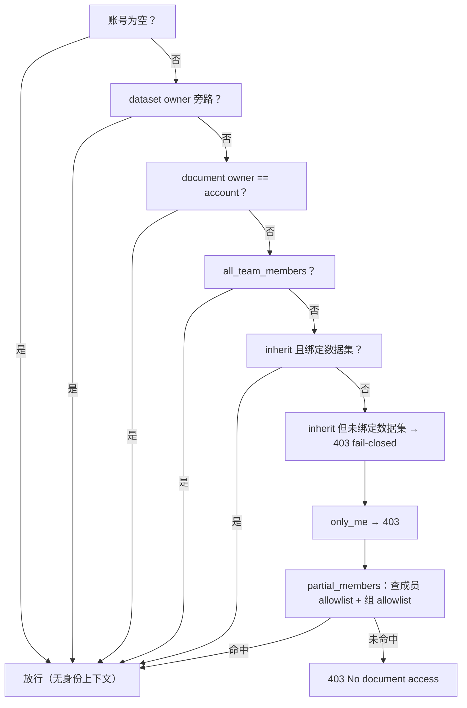
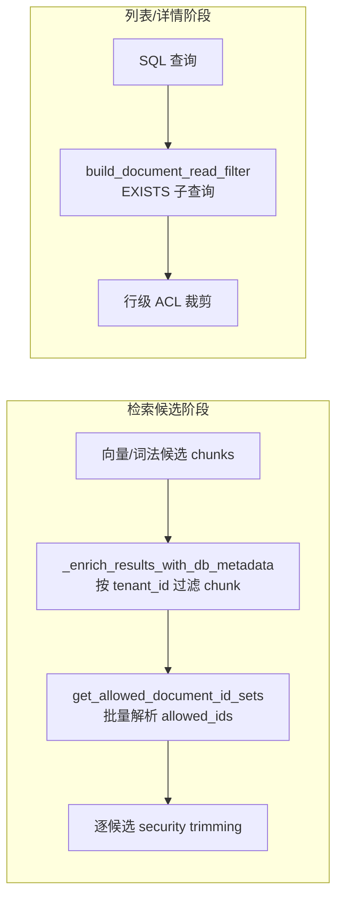

本文深入解析 MimirQ 的**身份与权限边界**架构：从租户隔离的物理数据模型，到基于角色的租户级功能权限（RBAC），再到数据集与文档两级资源授权（Dataset ACL / Document ACL）。核心设计原则贯穿全文——**任何访问都必须依次通过「租户边界 → 租户成员身份 → 资源授权」三层校验，且文档级 ACL 只做收紧、不做放宽**。

## 多租户：数据模型与租户解析

### 物理隔离的数据模型

MimirQ 采用**共享库 + 每行 `tenant_id` 列**的软隔离模式（schema-per-tenant 的对立面）。核心资源表——`documents`、`document_chunks`、`datasets`、`conversations`、`messages`、`audit_logs`、`kg_entities` 等——全部携带 `tenant_id` 列，并在基线迁移中建立索引。跨表引用通过**复合外键**强制同租户约束：例如 `documents(tenant_id, dataset_id)` 必须引用 `datasets(tenant_id, id)`，从数据库层面杜绝「A 租户文档挂到 B 租户数据集」的越权写入。

租户与成员的基础表定义在 [app/models/tenant.py](app/models/tenant.py#L15-L49)：

| 表 | 关键列 | 约束/语义 |
|---|---|---|
| `tenants` | `id` UUID、`name` 唯一、`status`、`plan` | 租户生命周期状态（active）与订阅计划（basic） |
| `tenant_members` | `tenant_id`、`user_id`（字符串）、`role`、`is_active`、`is_current` | `UNIQUE(tenant_id, user_id)`；`user_id` 为字符串以兼容 JWT `sub` 与 IdP 账号 |
| `documents` | `tenant_id`、`dataset_id` | 复合外键 `(tenant_id, dataset_id) → datasets` |
| `datasets` | `tenant_id`、`name` | `UNIQUE(tenant_id, name)` 避免租户内重名 |

Sources: [tenant.py](app/models/tenant.py#L15-L49)、[document.py](app/models/document.py#L30-L48)、[dataset.py](app/models/dataset.py#L23-L47)、[0001_baseline_schema.py](alembic/versions/0001_baseline_schema.py#L179-L199)

`tenant_members.user_id` 使用 `String(255)` 而非外键关联 `users` 表，是有意为之的架构决策：生产环境用户由 IdP（OIDC/SCIM）供给，`user_id` 即 JWT `sub` 声明，本地 `users` 表仅服务开发/自托管登录场景。成员表通过 `is_active` 支持**不硬删除的优雅移除**（deprovisioning），`is_current` 标记当前生效的租户上下文。

### 请求级租户解析：JWT 优先，Header 兜底

租户上下文由 FastAPI 依赖 `get_tenant_id` 解析，遵循严格的优先级：

关键行为（[app/api/dependencies/tenant.py](app/api/dependencies/tenant.py#L101-L107)）：

- **JWT 租户声明优先**：若配置了 `JWT_TENANT_CLAIM`，则从验证过的 JWT payload 提取租户 ID。声明存在但非法（非 UUID）时直接判为无效 token（401），防止租户伪造（[auth.py](app/api/dependencies/auth.py#L32-L43)）
- **Header 匹配强制**：`JWT_ENFORCE_TENANT_HEADER_MATCH=true` 时，要求 `X-Tenant-ID` 与 JWT 租户声明**逐字符一致**，杜绝「携带 A 租户 token 却声明 B 租户头」的混淆攻击（[auth.py](app/api/dependencies/auth.py#L95-L105)）
- **生产环境 Header 必填**：无 JWT 租户声明且无 Header 时，生产环境直接 400；仅开发环境回退 `DEFAULT_TENANT_ID`（[tenant.py](app/api/dependencies/tenant.py#L89-L98)）
- **可信网关模式**：`TENANT_HEADER_TRUSTED=true` 允许显式信任由网关重写注入的租户头——仅当部署确实由可信网关剥离/重注入头时才安全（[.env.example](.env.example#L292-L300)）

配套测试验证了「JWT 租户绑定不可被配置绕过」「无租户声明时回退 Header」「SCIM opaque token 场景走 Header 不解码 JWT」等关键路径（[test_tenant_dependency_prefers_verified_jwt_tenant.py](tests/test_tenant_dependency_prefers_verified_jwt_tenant.py#L36-L107)）。

Sources: [tenant.py](app/api/dependencies/tenant.py#L63-L107)、[auth.py](app/api/dependencies/auth.py#L172-L234)、[config.py](app/core/config.py#L875-L885)

### 成员供给：开发引导、JWT 自动供给与 SCIM

租户成员有三种进入路径，均收敛到 `tenant_members` 表：

| 路径 | 触发条件 | 行为 | 位置 |
|---|---|---|---|
| 开发引导 | 非生产环境 + 首次访问 | 自动创建 `tenants` + `owner` 成员 | [dataset_service.py](app/services/dataset_service.py#L31-L54) |
| JWT 自动供给 | `JWT_TENANT_MEMBER_AUTO_PROVISION_ENABLED=true` | 认证期间 best-effort 创建成员，失败不阻塞认证 | [auth.py](app/api/dependencies/auth.py#L144-L164) |
| SCIM 供给 | SCIM 协议调用 | 企业目录驱动的成员增删/停用 | [tenant_member_provisioning_service.py](app/services/tenant_member_provisioning_service.py#L33-L90) |

其中 `ensure_member` 是**所有授权检查的入口闸门**：先查成员存在性，再校验 `is_active`，任何失败均返回 403「Not a tenant member」（[dataset_service.py](app/services/dataset_service.py#L24-L58)）。

### 数据库层 RLS 加固（可选）

`app/services/tenant_rls.py` 提供 PostgreSQL **行级安全策略生成器** `build_tenant_rls_bundle`，为需要数据库兜底隔离的场景生成完整 SQL 包：

- `is_admin()`：`SECURITY DEFINER` 函数，检查 `auth.uid()` 在 `profiles`（租户表）中是否具有 admin 角色，`SET search_path = pg_catalog` 防搜索路径劫持
- `tenant_matches(resource_tenant)`：检查当前认证用户是否属于给定租户
- 每张受管表的策略统一为 `is_admin() OR tenant_matches(tenant_id)`，读用 `FOR SELECT`、写用 `FOR ALL ... WITH CHECK`

生成器对所有标识符与字面量做严格引号转义，测试用 SQL 注入样本（`profiles"; DROP TABLE audit; --`）验证了输出安全性（[tenant_rls.py](app/services/tenant_rls.py#L29-L94)、[test_tenant_rls.py](tests/test_tenant_rls.py#L32-L49)）。RLS 是应用层租户过滤之外的**纵深防御层**，适合对强合规要求（如审计表、消息表）启用。

Sources: [tenant_rls.py](app/services/tenant_rls.py#L48-L94)、[test_tenant_rls.py](tests/test_tenant_rls.py#L5-L29)

## RBAC：租户级功能权限

### 角色体系

MimirQ 定义了 6 个租户角色（[constants.py](app/core/constants.py#L221-L239)）：

| 角色 | 可编辑数据集 | 管理能力 | 说明 |
|---|---|---|---|
| `owner` | ✅ | ✅（全部） | 租户所有者，自动引导创建 |
| `admin` | ✅ | ✅（全部） | 管理员 |
| `auditor` | ❌ | 审计读 | 只读审计/表 SQL 查询 |
| `editor` | ✅ | 部分（feedback 分类） | 内容编辑 |
| `dataset_operator` | ✅ | 部分 | 数据集运维 |
| `viewer` | ❌ | 无 | 只读 |

集合常量：`EDIT_ROLES = {owner, admin, editor, dataset_operator}`（写权限门槛）、`ADMIN_ROLES = {owner, admin}`（管理操作门槛）。

### 权限声明与角色映射

租户级功能权限（settings/observability/usage/audit 等）通过 `TenantPermissions` 常量声明，并由 `_PERMISSION_ROLES` 映射表集中管理（[rbac_service.py](app/services/rbac_service.py#L18-L49)）：

| 权限 | 允许角色 |
|---|---|
| `settings.read` / `settings.write` | owner, admin |
| `observability.read` / `usage.read` | owner, admin |
| `audit.read` / `table_sql.read` | owner, admin, auditor |
| `audit.manage` / `lifecycle.manage` | owner, admin |
| `feedback_triage.write` | owner, admin, editor, dataset_operator |

**核心思想**：API 端点不自行硬编码角色集合，而是调用 `ensure_tenant_permission(db, tenant_id, account_id, permission)`——先过 `ensure_member` 成员闸门，再查角色映射，未命中即 403（[rbac_service.py](app/services/rbac_service.py#L67-L86)）。这使「新增一个功能页面」只需注册权限常量 + 映射，而无需审计每个端点。

当前成员权限查询端点 `/api/v1/rbac/me` 返回角色与派生权限列表，测试验证了 auditor 获得 `["audit.read", "table_sql.read"]` 而 owner 获得完整管理权限（[test_rbac_current_access_endpoint.py](tests/test_rbac_current_access_endpoint.py#L46-L73)）。

Sources: [rbac_service.py](app/services/rbac_service.py#L18-L96)、[constants.py](app/core/constants.py#L221-L239)

## 数据集级权限（Dataset ACL）

### 权限三态

`datasets.permission` 使用枚举 `DatasetPermissionEnum`（[dataset.py](app/models/dataset.py#L17-L20)）：

- **`all_team_members`**（默认）：租户内成员可读；写仍需 edit 角色或 owner
- **`only_me`**：仅 dataset owner 可读
- **`partial_members`**：owner + allowlist 可读（成员 allowlist + 组 allowlist）

### 读权限判定

`check_dataset_permission` 按优先级短路（[dataset_service.py](app/services/dataset_service.py#L197-L251)）：

组 allowlist 是成员 allowlist 之后的**兜底匹配**：解析账号所属的全部租户组，与 `dataset_group_permissions` 求交集，命中即放行。两种 allowlist 都未命中时通过 `authz_prometheus_metrics` 记录 `deny_no_groups` / `deny_no_match` 指标，用于权限拒绝的可观测性（[dataset_service.py](app/services/dataset_service.py#L225-L251)）。

### 写权限判定

`assert_dataset_writable` 在成员 + edit 角色基础上叠加资源条件：owner 直接放行；`all_team_members` 放行；`partial_members` 需成员或组 allowlist 命中（[dataset_service.py](app/services/dataset_service.py#L259-L303)）。注意**读写不对称**：读权限由 `permission` 三态控制，写权限始终要求角色与 allowlist 双重满足，`viewer`/`auditor` 无写路径。

Sources: [dataset_service.py](app/services/dataset_service.py#L197-L303)、[dataset.py](app/models/dataset.py#L17-L72)

## 用户组：企业目录原语

### 数据模型与迁移

`tenant_groups` 与 `tenant_group_members` 是租户作用域的目录原语（[tenant_group.py](app/models/tenant_group.py#L25-L68)）：

- `tenant_groups`：`UNIQUE(tenant_id, name)` 租户内组名唯一；`external_id` 承载 IdP 稳定标识（OIDC 组声明 / SCIM 组供给）
- `tenant_group_members`：`UNIQUE(tenant_id, group_id, user_id)` + 复合外键 `(tenant_id, group_id) → tenant_groups`，`ON DELETE CASCADE`

迁移脚本 [0010_add_tenant_groups.py](alembic/versions/0010_add_tenant_groups.py#L17-L48) 与 [0011_add_group_permissions.py](alembic/versions/0011_add_group_permissions.py#L17-L53) 分别建立组/成员表和数据集/文档的组 allowlist 表，后者通过 `(tenant_id, group_id)` 复合外键保证**组授权永远限定在租户内**。

### 组解析与请求级缓存

`resolve_account_group_ids` 解析账号的组 ID 集合，并将结果缓存在 `request.state._mimirq_group_ids_cache`——同一 API 请求内的多次权限检查（数据集读 + 文档 ACL + 生命周期操作）共享一次 DB 查询（[tenant_group_service.py](app/services/tenant_group_service.py#L40-L82)）。组 CRUD API 位于 `/api/v1/groups`（[groups.py](app/api/v1/groups.py#L43-L242)），支持成员增删与组删除级联清理授权。

### JWT 组声明同步

企业场景下，组信息直接来自 IdP：`JWT_GROUPS_SYNC_ENABLED=true` 时，认证期间 best-effort 将 JWT 中 `JWT_GROUPS_CLAIM`（默认 `"groups"`，支持点路径如 `realm_access.roles`）解析出的组名 upsert 到 `tenant_groups` 并建立成员关系（[jwt_group_sync_service.py](app/services/jwt_group_sync_service.py#L22-L100)）。同步失败**绝不阻塞认证**，且有进程内 TTL 节流（默认 60 秒）与 PII 脱敏日志约束。SCIM 提供另一条 IdP 驱动供给路径。

Sources: [tenant_group.py](app/models/tenant_group.py#L25-L68)、[tenant_group_service.py](app/services/tenant_group_service.py#L38-L82)、[jwt_group_sync_service.py](app/services/jwt_group_sync_service.py#L22-L100)

## 文档级 ACL（Security Trimming）

### 核心原则：只收紧，不放宽

文档级 ACL 是 MimirQ 企业检索能力（security trimming）的关键。**用户必须先通过数据集可读校验，再通过文档级 ACL 校验**才能看到文档及其切块/引用——文档级 ACL 永远不会把数据集不允许的内容放行。

文档表两个 ACL 字段（[document.py](app/models/document.py#L61-L69)）：

- `owner_id`：文档属主（通常为上传者或 connector 发起者）
- `access_mode`：四种模式

| `access_mode` | 语义 | 可见范围 |
|---|---|---|
| `NULL` / `inherit` | 默认，完全继承数据集权限 | 数据集内成员（受数据集 ACL 约束） |
| `only_me` | 仅属主可见 | owner 本人 |
| `partial_members` | 属主 + allowlist | owner + `document_permissions` 成员 + `document_group_permissions` 组 |
| `all_team_members` | 租户内成员可见 | 所有租户成员（仍受数据集 ACL 约束） |

allowlist 存储于两张表：`document_permissions`（成员级，`UNIQUE(document_id, account_id)`）与 `document_group_permissions`（组级，`UNIQUE(tenant_id, document_id, group_id)`），后者通过 `(tenant_id, group_id)` 复合外键强制组必须属于同租户（[document.py](app/models/document.py#L119-L133)、[group_permissions.py](app/models/group_permissions.py#L46-L65)）。

### API 层强制：`assert_document_acl_readable`

所有文档读端点（详情、内容、切块、时间线、健康检查、资产）统一调用此守卫（[document_access_service.py](app/services/document_access_service.py#L19-L83)）：

关键细节：

- **数据集 owner 旁路**：数据集 owner 始终可访问其数据集下所有文档（管理/运维用途），即使文档 `only_me` 属主是他人（L37-L38）
- **未绑定数据集的文档**（unassigned）：没有父级 ACL 可继承，因此 `inherit` 对非属主 **fail-closed** 为 403——「无父级授权即最严格」（L48-L51）
- **未知模式一律 403**：防御纵深，新枚举值不会意外放行（L83）

写路径 `assert_document_writable_for_unassigned_target` 要求：admin 角色旁路；或 edit 角色且为文档属主（[document_access_service.py](app/services/document_access_service.py#L115-L133)）。ACL 修改端点 `PUT /api/v1/documents/{id}/access` 遵循**数据集写权限或未绑定文档属主策略**，修改时校验 allowlist 成员/组必须真实存在于当前租户（防拼写错误导致「以为限制了实际全开」），并写入 `document.access.update` 审计事件（[document_access.py](app/api/v1/document_access.py#L73-L156)）。

Sources: [document_access_service.py](app/services/document_access_service.py#L19-L133)、[document_access.py](app/api/v1/document_access.py#L33-L156)、[document_permission_service.py](app/services/document_permission_service.py#L19-L157)

### 检索链路中的 ACL 强制

检索是 ACL 最易泄漏的环节。MimirQ 在**混合检索后处理阶段**做候选级 security trimming（[post_process.py](app/rag/retrieval/hybrid/post_process.py#L275-L324)）：

1. 收集检索候选的 document_id 集合，过滤掉未就绪（非 completed）文档
2. 若指定了 dataset_filters，先按数据集收缩候选
3. 调用 `get_allowed_document_id_sets` 批量解析允许集合（**成员 allowlist + 组 allowlist + owner + 数据集 owner 旁路**合并判定）
4. 逐候选过滤：不在允许集合的 chunk 标记 `filtered_acl` 并丢弃；异常时 **fail-closed**（允许集置空，不返回任何可能敏感的 chunk）

`get_allowed_document_id_sets` 的批量语义（[document_access.py](app/services/document_access.py#L228-L356)）：

- `missing_ids`：租户下不存在的文档 ID（供 404 语义）
- `allowed_ids`：账号可读的文档 ID
- 未绑定数据集的文档：仅 owner 或显式 ACL/组授权可读（`has_dataset=False` 时 `inherit` 失败关闭）
- 绑定数据集的文档：数据集 owner 旁路优先；否则按 `access_mode` 逐文档判定

对于列表型查询（文档列表、数据集列表），系统提供 SQL 谓词构造器 `build_dataset_read_filter` 与 `build_document_read_filter`，将 ACL 语义编译为 `EXISTS` 子查询（成员 allowlist、组 allowlist 通过 `TenantGroupMember` 子查询关联），在数据库层完成行级裁剪（[document_access.py](app/services/document_access.py#L34-L97)）。

Sources: [post_process.py](app/rag/retrieval/hybrid/post_process.py#L275-L372)、[document_access.py](app/services/document_access.py#L34-L97)

## 连接器 ACL 继承

企业连接器（Jira、Drive 等）将源系统的权限映射为文档级 ACL 覆盖：`resolve_document_access_from_source_acl` 把源对象 principal 映射到租户组，产出 `DocumentAccessUpdateRequest`（[connector_source_acl_mapping.py](app/services/connector_source_acl_mapping.py#L18-L71)）：

- `allow_anyone && has_anyone()` → `all_team_members`
- principal 命中映射规则 → `partial_members` + 组列表（确定性排序，上限 200）
- 无映射 → 回退 `fallback_mode`（默认 `partial_members`，即仅 owner）

**默认 fail-closed**：源 ACL 无法解析时不给任何放宽，宁紧勿松。

Sources: [connector_source_acl_mapping.py](app/services/connector_source_acl_mapping.py#L18-L71)

## 配置项速查

| 配置 | 默认 | 说明 |
|---|---|---|
| `AUTH_MODE` | `jwt` | `header` 模式仅限开发，生产禁止 |
| `JWT_TENANT_CLAIM` | 空 | JWT 中租户 ID 声明；生产推荐配置 |
| `JWT_ENFORCE_TENANT_HEADER_MATCH` | `false` | 强制 Header 与 JWT 租户一致 |
| `TENANT_HEADER` | `X-Tenant-ID` | 租户头名称 |
| `TENANT_HEADER_TRUSTED` | `false` | 仅可信网关部署可开启 |
| `JWT_GROUPS_SYNC_ENABLED` | `false` | 从 JWT 声明同步用户组 |
| `JWT_GROUPS_CLAIM` | `groups` | 组声明路径，支持点路径 |
| `JWT_TENANT_MEMBER_AUTO_PROVISION_ENABLED` | `false` | 认证时自动供给租户成员 |

Sources: [config.py](app/core/config.py#L875-L891)、[.env.example](.env.example#L292-L300)

## 测试保障

权限体系有专门测试覆盖，重点包括：

- **租户绑定**：JWT 租户声明不可绕过、SCIM opaque token 走 Header（[test_tenant_dependency_prefers_verified_jwt_tenant.py](tests/test_tenant_dependency_prefers_verified_jwt_tenant.py#L36-L107)）
- **RLS 生成器**：策略内容与 SQL 注入转义（[test_tenant_rls.py](tests/test_tenant_rls.py#L5-L49)）
- **未绑定文档 ACL**：非属主 `inherit` 拒绝、admin 旁路、owner-editor 放行等 20+ 用例（[test_unassigned_document_permissions.py](tests/test_unassigned_document_permissions.py#L121-L700)）
- **RBAC 端点**：auditor 与 owner 的权限派生（[test_rbac_current_access_endpoint.py](tests/test_rbac_current_access_endpoint.py#L46-L73)）
- **检索侧边界**：`test_second_pass_backend_permissions.py`、`test_security_boundary_permissions.py`、`test_document_group_acl_views.py` 验证候选级与 SQL 谓词级裁剪

## 架构总结

三层权限边界形成纵深防御：**租户隔离（物理列 + 复合外键 + RLS）→ 成员身份与角色（RBAC）→ 资源授权（数据集 ACL → 文档 ACL → 检索裁剪）**。文档级 ACL 的「只收紧不放宽」原则确保任何上层放宽（如 `all_team_members`）都不会突破数据集边界；检索链路的 fail-closed 与未知模式拒绝则保证未来的扩展不会意外引入权限泄漏。

下一步建议阅读：[API 分层设计与认证鉴权](6-api-fen-ceng-she-ji-yu-ren-zheng-jian-quan) 了解认证链路的完整视图；[连接器与多源数据接入](11-lian-jie-qi-yu-duo-yuan-shu-ju-jie-ru) 查看源 ACL 继承的具体实现；[安全加固：JWT、PII 与限流](27-an-quan-jia-gu-jwt-pii-yu-xian-liu) 掌握令牌验证与限流的纵深配置。