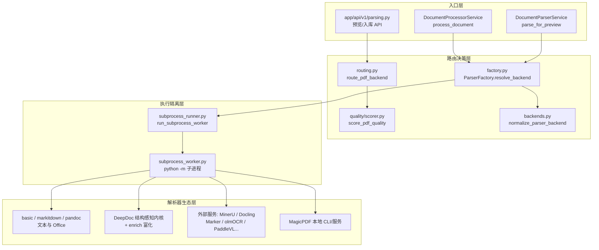
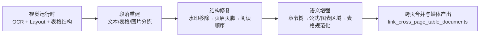
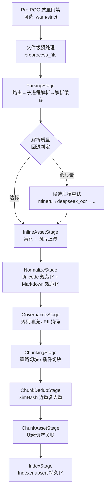

文档入库的第一步，是把异构的原始文件转化为可检索、可切块、可追溯的结构化文本。MimirQ 的解析后端围绕一个核心矛盾展开：**文件形态的极端多样性与检索质量的强约束**。从纯文本、Office 文档到扫描件、表格密集型 PDF、图片与音视频，每一种格式都需要不同的解析策略；而解析质量直接决定后续切块、向量化与检索的上限。本页解析这一层的完整机制：解析器注册与路由、质量驱动的智能选型、子进程隔离执行、内置结构感知解析内核、富化流水线，以及从解析到索引的八阶段处理编排。

## 总体架构：三层解析体系

解析后端由三个逻辑层构成：**路由决策层**（选择"用什么解析"）、**执行隔离层**（决定"在哪里解析"）与**解析器生态层**（定义"有哪些解析器可用"）。

路由层不直接执行解析。`ParserFactory` 依据文件扩展名与用户显式选择，解析出规范化的后端标识；对于 PDF，`route_pdf_backend` 先对文档做轻量质量评分，再依据评分与配置可用性决定首选后端；真正的解析动作在独立子进程中执行，以确保 torch 等重型解析器可被强制终止。Sources: [routing.py](app/parsing/routing.py#L1-L22)、[factory.py](app/parsing/factory.py#L96-L132)、[subprocess_worker.py](app/parsing/subprocess_worker.py#L1-L18)

## 解析器注册与后端归一化

**后端归一化**是路由的起点。`backends.py` 维护一张别名表，把用户输入、环境变量与 UI 传参中的常见写法映射到内部规范标识——例如 `pymupdf`/`fitz` → `basic`、`magic-pdf` → `magicpdf`、`bisheng-unstructured` → `etl4llm`。这一层把外部生态的命名差异收敛为 15 个左右的规范后端名。Sources: [backends.py](app/parsing/backends.py#L14-L72)

`ParserFactory` 是解析器生态的注册中心。它定义了三个关键集合：**PDF 高级回退后端集**（docling、deepdoc、marker、paddle_vl、glm_ocr、olmocr、qianfan_ocr、textin、mineru、magicpdf、deepseek_ocr、etl4llm——高级后端失败时统一回退到 basic）、**支持的 PDF 后端全集**（含 auto 与 colpali）与**非 PDF 扩展名/后端规则**。工厂通过 `PDF_PARSER_SPECS` 声明式登记每个 PDF 后端的类路径与初始化日志，实现懒加载——只有被选中时才会实例化对应解析器。Sources: [factory.py](app/parsing/factory.py#L131-L192)

非 PDF 文件的解析规则是**扩展名直连**的：`PLAIN_TEXT_EXTENSIONS`（含 30+ 种源码扩展名与配置文件格式）直接走 `TextParser`；`.md` 走 `MarkdownParser`；`.eml/.msg` 走 `EmailParser`；图片默认走 `ImageParser`（显式选择 textin 时例外）。Office 类格式（doc/docx/ppt/xls/csv/html/json）则依据后端选择在 markitdown、pandoc、excel、docx、pptx 等专用解析器间决策。Sources: [factory.py](app/parsing/factory.py#L352-L415)

## PDF 智能路由：质量评分驱动的决策

PDF 是解析复杂度最高的格式，MimirQ 为它设计了**评分先行、规则决策**的路由机制。`score_pdf_quality` 以 pdfplumber 采样前 3 页，从四个维度评估文档质量：

| 维度 | 权重 | 度量内容 |
|------|------|---------|
| 文本质量 | 40% | 文本量、可读性、OCR 噪声、扫描件判定 |
| 格式一致性 | 25% | 字体多样性、行距方差、段落结构 |
| 表格完整性 | 20% | 表格检出率、对齐质量 |
| 阅读顺序 | 15% | 词流的几何一致性 |

最终得分被归一化到 0-1，并附带 `is_scanned`、`page_count` 与 `preprocess_info`（倾斜角、方向、水印检测等轻量预处理线索）。Sources: [scorer.py](app/parsing/quality/scorer.py#L30-L107)

`choose_pdf_backend` 依据得分与扫描标记执行分级决策：

- **score ≥ 0.8 且非扫描**：文档结构干净，优先 Docling（结构感知）→ ETL4LLM → MarkItDown → DeepDoc → basic，避免对高质量文本 PDF 做重型 OCR；
- **score ≤ 0.5 或扫描件**：进入 OCR 强后端链，优先 MinerU → DeepSeek OCR → Qianfan OCR → ETL4LLM → DeepDoc → Docling → MagicPDF → MarkItDown → basic；
- **中段区间**（0.5-0.8）：走 Docling → ETL4LLM → DeepDoc → MinerU 的结构解析链；
- **两个例外短路**：表格密集但 PyMuPDF 仍可抽文本的 PDF（`is_scanned` 且 `text_quality_score ≥ 0.1`）、小页数文本可抽取 PDF（≤5 页且文本质量 ≥0.3），直接走 basic 以节省交互式预览的延迟。

用户显式指定后端时（非 `auto`）该决策被直接尊重，校验推迟到工厂层。Sources: [routing.py](app/parsing/routing.py#L57-L146)

## 子进程隔离：可强制取消的重型解析

解析器（尤其是 torch 系的 Docling、MinerU、PaddleOCR-VL）在进程内不可协作式取消。MimirQ 的解法是把解析动作**下沉到独立 Python 子进程**：`subprocess_runner.run_subprocess_worker` 生成 payload/result/log 三件套文件，以 `python -m app.parsing.subprocess_worker <payload> <result>` 启动子进程，并通过三路取消源（FastAPI 断连检查、文档状态取消、asyncio 任务中止）实现真正终止——先 SIGTERM 进程组、宽限期后 SIGKILL。Sources: [subprocess_runner.py](app/parsing/subprocess_runner.py#L117-L180)

子进程内部由 `_parse_documents` 承载核心逻辑：再次确认 PDF 路由（未显式指定且无缓存质量分时重新评分）→ 调用 `parse_with_provenance` → 按模式处理产物。**preview 模式**将解析出的图片物化为本地文件并重写引用；**ingest 模式**则将 PIL.Image 对象落盘为 JPEG（避免跨进程 pickle），并把 `image_path` 写入元数据供父进程上传 MinIO。Sources: [subprocess_worker.py](app/parsing/subprocess_worker.py#L145-L240)

`parse_with_provenance` 是工厂层的统一解析入口，它记录完整的尝试链：主后端成功的耗时与文档数、失败后逐级回退的 `attempts` 列表（含 `fallback_from` 与错误摘要），最终产出 `(documents, resolved_backend, provenance)` 三元组。这份 provenance 被持久化到文档元数据的 `parse_provenance` 字段，成为解析审计与调试的溯源依据。Sources: [factory.py](app/parsing/factory.py#L762-L820)

## 解析器生态：内置、外部服务与本地模型

解析器生态横跨三种部署形态，全部通过 `PDF_SETTING_REQUIREMENTS` 声明式校验启用条件（开关标志 + 必需配置项）：

| 后端 | 部署形态 | 能力特征 | 启用条件 |
|------|---------|---------|---------|
| basic | 内置 PyMuPDF | 快速文本抽取 | 默认可用 |
| DeepDoc | 内置视觉管线 | 布局/OCR/表格结构/富化 | `DEEPDOC_ENABLED` |
| Docling | 外部服务/进程内 | 结构感知、DOCX 兼用 | `DOCLING_ENABLED` |
| MinerU | Docker 服务 | 复杂布局、公式、表格 | `MINERU_ENABLED` + token/本地 URL |
| MagicPDF | 本地 CLI 或服务 | PDF-Extract-Kit 模型 | `MAGIC_PDF_ENABLED` + 模型目录 |
| Marker / olmOCR / PaddleVL | Docker 服务 | PDF→Markdown、视觉 OCR | 对应 `*_ENABLED` + `*_API_URL` |
| DeepSeek OCR / Qianfan OCR | 云端 API | 扫描件 OCR | `*_ENABLED` + API key/URL |
| ETL4LLM | Docker 服务 | 版式感知 | `ETL4LLM_ENABLED` + API URL |
| TextIn | 云端 API | xParse 多格式 | `TEXTIN_ENABLED` + 凭据 |
| ColPali / ColQwen | 内置视觉 | 页面级视觉嵌入 | `colpali` 显式选择 |

外部服务通过 `docker-compose.parsers.yml` 的 profile 体系按需拉起（`--profile mineru`、`--profile marker` 等），每个服务在 Docker 网络内以 `mimirq-<name>` 别名互通，并配套 healthcheck 与模型缓存卷。MinerU 服务还包含一次性模型预热容器 `mimirq-mineru-models`，解决 Docker build 无法写入运行期缓存卷的问题。Sources: [docker-compose.parsers.yml](docker/docker-compose.parsers.yml#L1-L120)、[factory.py](app/parsing/factory.py#L194-L240)

所有高级解析器继承 `BaseAdvancedParser` 抽象基类，统一提供懒加载、安装检查、文件校验、进度回调和"段落/表格 → LangChain Document"的转换骨架。`_convert_sections_to_documents` 解析 `@@页码\t左\t右\t上\t下##` 位置标签，将 Docling/MinerU 等解析器的位置信息保留为结构化元数据——这是后续跨页合并与位置感知检索的基础。Sources: [base_parser.py](app/parsing/parsers/base_parser.py#L29-L100)

## DeepDoc：内置结构感知解析内核

DeepDoc 是随仓库分发的唯一内置重型解析器，源自 InfiniFlow 开源生态，被 `DeepDocParser` 桥接进 MimirQ 流水线。其 PDF 解析流程可概括为**五段式**：

DeepDoc 的视觉层（`app/deepdoc/vision`）组合了 `OCR`（文字识别）、`LayoutRecognizer4YOLOv10`（版式检测）与 `TableStructureRecognizer`（表格结构）。表格重建是其亮点：布局模型先定位表格区域，表格结构识别器产出 header/row/column/spanning 组件，再经 `_apply_table_span` 把跨列合并单元格的语义写回每个文本框。Sources: [vision/__init__.py](app/deepdoc/vision/__init__.py#L18-L42)、[pdf_parser.py](app/deepdoc/parser/pdf_parser.py#L466-L527)

解析后的段落记录依次经过 `remove_document_watermark_elements`（水印移除）、`remove_repeated_header_footer_elements`（页眉页脚去重）与 `fix_reading_order_elements`（阅读顺序修复），再以 `build_section_tree`/`add_section_paths` 构建章节树并把层级路径注入元素元数据。表格单元走 `profile_markdown_table` + `extract_markdown_table` 双通道：先判定 Markdown 表格形态，再通过 ONNX 表格结构模型（`predict_table_structure_detections`）补充结构检测，最终渲染为 markdown/html/csv 三种输出并存于 `table_outputs`。Sources: [deepdoc_parser.py](app/parsing/parsers/deepdoc_parser.py#L480-L672)

媒体元素（图片/表格）的处理包含一整套图像算法：`select_table_rotation`（旋转矫正）、`classify_table_grid_type`（网格类型判定）、`extract_ocr_lines_from_image` + `bind_ocr_lines_to_table_cells`（OCR 行绑定到单元格）、`detect_chart_regions`/`detect_formula_regions`（图表与公式区域检测）、`profile_document_image_with_models`（文档图像画像）。跨页表格由 `link_cross_page_table_documents` 在文档集合层面合并。Sources: [deepdoc_parser.py](app/parsing/parsers/deepdoc_parser.py#L557-L672)

## 小模型运行时与资源约束

DeepDoc 依赖的视觉模型由 `SmallModelRuntime` 统一管理，其模型清单来自 `config/parsing_small_models.yaml`，按任务（layout / table_detection / table_structure / OCR 等）声明默认模型与候选模型。每个模型规格声明 `kind`（onnx / hf_transformers）、`cpu_feasible`、`max_size_mb` 与来源。默认的 layout 与表格结构模型是随仓库捆绑的 ONNX（`layout.onnx`、`tsr.onnx`），CPU 可推理；可选的重型模型（如 PaddlePaddle/PP-DocLayoutV3、microsoft/table-transformer）被标记为 `cpu_feasible: false`，仅在 GPU 可用时加载。运行时按需从 HuggingFace 拉取快照并做路径/大小校验，加载结果以 `SmallModelStatus` 上报可用性。Sources: [parsing_small_models.yaml](config/parsing_small_models.yaml#L1-L80)、[runtime.py](app/parsing/models/runtime.py#L56-L100)

## 富化流水线：从文本到语义增强

解析产出原始 Markdown 后，`InlineAssetStage` 承担**可选富化**，全部为 best-effort 设计——任何富化步骤失败都不阻断入库：

| 富化能力 | 实现模块 | 触发开关 | 产出 |
|---------|---------|---------|------|
| 图片代码块提取 | `image_code.py` | 恒启用 | 代码片段 + `derived_elements` |
| 公式 OCR→LaTeX | `formula_ocr.py` | `FORMULA_OCR_ENABLED` | LaTeX 块 + 公式元素审计 |
| 图表→结构化数据 | `chart_to_data.py` | `CHART_TO_DATA_ENABLED` | 数据块 + 审计 |
| 图片标题 | `image_caption.py` / `vlm_image_caption.py` | `IMAGE_CAPTION_VLM_ENABLED` | 启发式或 VLM 标题 |
| 内联图片上传 | `processor._upload_inline_images_to_minio` | `MINIO_ENABLED` | MinIO 对象 + img_id |

每个富化步骤都把新增的元素追加到 `derived_elements` 元数据，并保留 `audit.to_dict()` 审计信息（后端类型、耗时、图片数）。公式与图表通过 `add_formula_latex_blocks`/`add_chart_data_blocks` 的 `origin_path` 读取解析器落盘的本地图片，这意味着富化必须发生在内联图片重写为 MinIO 引用**之前**——阶段顺序是经过设计的依赖约束。Sources: [stages.py](app/parsing/processors/support/stages.py#L425-L599)

## 文档处理流水线：八阶段编排

`DocumentProcessorService.process_document` 是入库的总导演。它在单个方法内实例化八个阶段对象并依序执行：

阶段职责如下：

- **ParsingStage**：解析前先解析切块策略；若命中 `integrated_*` 策略则直接走集成管道子进程（`action: integrated_chunk`），否则执行 PDF 路由、远程解析缓存查询（MinIO）、子进程解析、解析质量画像（`score_parsed_text_quality`、`compute_parsing_artifact_stats`、`compute_document_analytics`）与缓存写回。Sources: [stages.py](app/parsing/processors/support/stages.py#L89-L200)
- **解析质量回退**：当 `parse_fallback_enabled` 且输出质量不达标（内容过短或解析得分低于阈值），按固定候选序（mineru → deepseek_ocr → qianfan_ocr → etl4llm → deepdoc → docling → magicpdf → markitdown → basic）逐级重试，每轮用 `should_attempt_pdf_fallback` 判定是否接受，最多 `parse_fallback_max_retries` 次。Sources: [processor.py](app/parsing/processors/processor.py#L1174-L1300)
- **GovernanceStage / NormalizeStage**：Normalize 是保守的 Unicode 规范化（行尾、控制字符、PDF 连字修复 + Markdown 规范化统计），Governance 则应用用户配置的规则清洗（PII 掩码等）。Sources: [stages.py](app/parsing/processors/support/stages.py#L635-L683)
- **ChunkingStage / ChunkDedupStage**：切块支持 separator 预设（paragraph 等）与 `chunker_factory` 注册的全部策略，且可被 Python 插件（`apply_chunk_python_plugin`）接管；去重基于 SimHash 内容摘要实现。Sources: [stages.py](app/parsing/processors/support/stages.py#L684-L872)
- **IndexStage**：将每个块包装为 `IndexRecord`（含页码、起止字符偏移），经 `Indexer.upsert` 一次性写入向量库与关系库。Sources: [processor.py](app/parsing/processors/processor.py#L238-L276)

全流程受 `cancel_check` 守护，任意阶段之间可被取消；每个阶段耗时被累积进 `ingest_stage_durations_ms` 元数据，用于性能观测。Sources: [processor.py](app/parsing/processors/processor.py#L524-L560)

## 预览解析与质量门禁

预览路径（`parse_for_preview`）与入库路径共享 `ParserFactory` 但更轻量：PDF 走 `route_pdf_backend` 评分选型，非 PDF 走后端路由；解析结果合并为单一 Markdown，并经历两级图片物化——`_materialize_local_images_for_preview` 把相对路径图片引用重写为 `/api/v1/documents/image/{uuid}` 预览 URL（含 SHA-256 内容去重与租户目录隔离），`_extract_and_save_inline_images` 则处理 base64 data URI 内嵌图片。两者都受 `MAX_INLINE_IMAGES` 与 `MAX_INLINE_IMAGE_BYTES` 上限约束。Sources: [parser_service.py](app/parsing/processors/parser_service.py#L278-L340)

API 层的 `_compute_parsing_quality_gate` 将解析文本质量、PDF 质量与文档解析得分合并为 pass/warn/fail 三级判定，用于预览界面的即时质量反馈；`parse_fallback_enabled` 的入库重试与预览路径共用同一套质量标尺。Sources: [parsing.py](app/api/v1/parsing.py#L325-L360)

## 解析缓存：跨后端的内容寻址复用

入库解析结果以**文件 SHA-256 + 解析后端 + 流水线哈希**为键写入 MinIO 缓存（`parse_cache_service`），命中时直接反序列化文档集合，跳过整个解析子进程。缓存键的 `config_hash` 取自文档元数据的 `pipeline_hash`，确保流水线配置变更后缓存自动失效；TTL 与大小上限由 `PARSE_CACHE_TTL_SEC`/`PARSE_CACHE_MAX_BYTES` 控制。缓存命中与未命中都会写入 `parse_cache` 元数据（schema、age_ms、backend），供观测面板区分解析耗时与缓存耗时。Sources: [stages.py](app/parsing/processors/support/stages.py#L262-L400)

## 小结

解析后端的设计主线可以概括为三个原则：**决策与执行分离**（路由层只做选择，子进程承担执行）、**质量闭环**（评分驱动选型、质量门禁触发回退、provenance 支撑审计）、**弹性降级**（高级后端失败逐级回退 basic，富化步骤永远 best-effort）。这套架构让 MimirQ 在保证解析质量上限的同时，把单点故障的爆炸半径压缩到最小。

接下来可以沿着知识入库链路继续深入：[切块策略与索引构建](10-qie-kuai-ce-lue-yu-suo-yin-gou-jian) 解析解析产物如何被切分与向量化；[数据治理画像与入库质量门禁](12-shu-ju-zhi-li-hua-xiang-yu-ru-ku-zhi-liang-men-jin) 详解治理规则与门禁策略；[存储层：向量库、对象存储与关系库](24-cun-chu-ceng-xiang-liang-ku-dui-xiang-cun-chu-yu-guan-xi-ku) 则展示解析产物最终的落点。