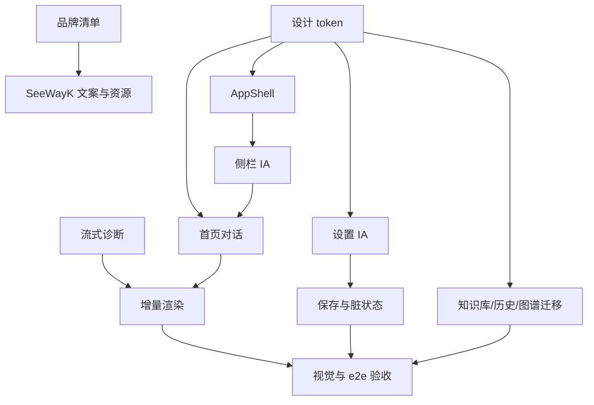

# 依赖图

```mermaid
flowchart TD
  A[流式诊断] --> B[增量渲染]
  C[品牌清单] --> D[SeeWayK 文案与资源]
  E[设计 token] --> F[AppShell]
  F --> G[侧栏 IA]
  E --> H[首页对话]
  G --> H
  H --> B
  E --> I[设置 IA]
  I --> J[保存与脏状态]
  E --> K[知识库/历史/图谱迁移]
  B --> L[视觉与 e2e 验收]
  J --> L
  K --> L
```
